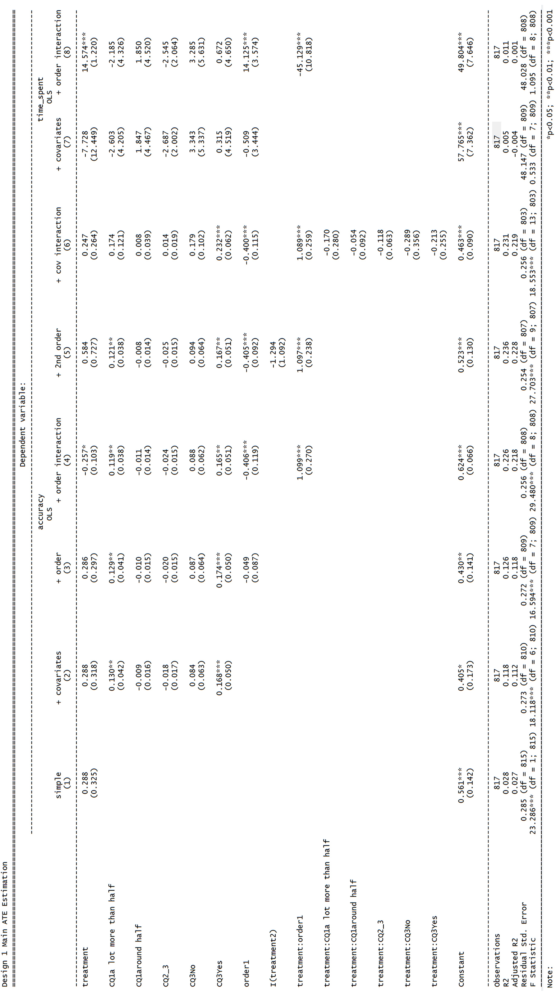
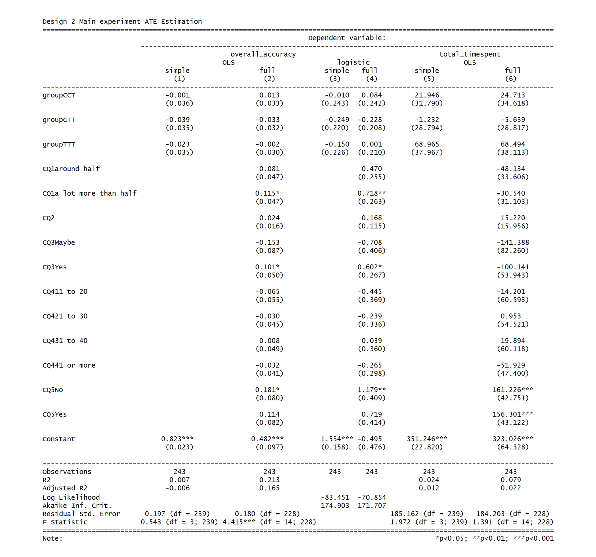

```{r,include=FALSE}
rm(list = ls())
```

```{r, include=FALSE}
#setwd("D:/MIDS/W241_1_Experiments_Causality/project/Field_Experiment_Human_Image_Classification/code")
#setwd("F:/001_Learn_UCB/241_Experiments_and_Causality/Field_Experiment_Human_Image_Classification/code")
setwd("C:/Users/chuco/Documents/Field_Experiment_Human_Image_Classification/code")
source(file = "design1_data_transformation_functions.r")
source(file = "design1_data_analysis_functions.r")
source(file = "design2_data_transformation_functions.r")
source(file = "design2_data_analysis_functions.r")
```

\centerline{\Large Legg Yeung, Stanimir Vichev, Frederic Suares}
\bigskip
\centerline{\Large University of California, Berkeley}
\bigskip
\centerline{\Large December 13, 2017}
\bigskip
\bigskip
\bigskip
\bigskip
\centerline{\bfseries Abstract}

> In this project, we look at the relationship between reward and work quality through the different perspective of employers and economists. We use two experimental designs, one being a traditional between-subject experiment and the other being a stepped-wedge design, to analysis effects of higher pay rate on returned work quality and effects of bonuses on worker performance. We utilize the functionalities of the Amazon Mechanical Turk platform and Qualtrics survey tools to randomly assign a human intelligence task to different pay rate in the first experimental design, and a turker to different bonus conditions in the second experimental design. Both experimental setups require turkers to correctly identify a set of 48 dog breed classification questions. Independent two-sample t-tests, linear and logistic regression models, and randomization inference are used to perform inference on data collected from the running the first experimental design. Linear and logistic regression models, general linear hypothesis, weighted difference-in-means and simulation of potential outcome schedules are used to perform inference on data collected from the running the second experimental design. Results from both experiments fails to reject the null hypothesis that higher reward has zero effect on work quality nor worker performance. Through out the experiment, we observe that tasks attached with higher rewards tend to be claimed much sooner but no effect is observed on the returned task accuracies.


# Introduction

In most economies, it is generally believed that remuneration for someone's work is strongly related to the effort they will put into it, and the eventual quality of the results. Unfortunately, this is a concept that is challenging to test in the normal world. Employers cannot easily conduct experiments with their own employees, say, by giving them similar tasks and different payments on a random basis, as this could be considered unethical and would lead to a serious disruption in the workforce. At the same time, such a study would be very helpful to employers who want to understand what motivates their employees, and what part the pay plays. 


The Amazon Mechanical Turk (AMT) platform for the crowdsourced completion of tasks provides a great opportunity for experimentally testing the relationship between payment and quality of work without having to worry about subject interaction or high costs of wasted man-hours. Our experiment uses the AMT platform to experimentally test whether higher payment for a task has a positive effect on the quality of its result. We used two different experimental designs (traditional between-subject and stepped-wedge), one randomly assign tasks to four different payment levels and the other randomly assign turkers to four different payment levels, to measure how resultant quality of work differ between groups.


The paper is organized as follows: section 2 gives an overview of prior research conducted on the same topic, section 3 states our research hyopthesis and identification strategies, section 4 walks through the two exerpimental designs and their motivations, detailing the platforms used and the experimental schedule, sections 5 and 6 present the data and analysis for the two experiment designs, section 6 discusses overall results, section 7 looks at the limitation of our project and suggest future lines of investigation, followed by a conclusion and bibliography.


A note on supplementary files: A clean, well organized Github repo is available for this project. It includes raw, intermediate and transformed data, along with data transformation, statistical and project management codes. Because of the length of extensiveness of these R functions, we decided to print such functions as a higher level of abstraction and maintain a natural presentation flow of the project. For project evaluation's sake, please refer to the .rmd file for our the hidden snippets, and our Github repo for any other materials. A web link to our Github repo will be submitted along with the final paper.


# Related Work

The use of online labor markets as an effective and efficient platform for social science experimentation has been noted by several studies, and explored in detail in Horton et. al. 2011. They perform several successful experiments and even look at the labor supply curves of workers. This shows that we have made the right choice of platform to conduct our research. Another experiment done by Horton  & Chilton, 2010, develops a novel method for estimating the smallest price for a task that a worker would accept. They also look into the way workers respond to incentives, with some being rational and some setting earnings targets. Finally, Mason & Watts, 2009, use the AMT platform to explore the effect of financial incentives on the performance of workers. They conclude that higher financial incentives increase the quantity, but not quality, of the work done by workers, citing an anchoring effect as the cause of this. By doing a similar experiment nearly 9 years later, we hope to see whether we get the same results as online labor markets such as AMT gain more prominence and popularity, leading to a more diverse market with more workers and requestors. 


# Research Hypothesis, Identification Strategy

We hypothesis that higher payment per human intelligence task (HIT) on average would lead to higher turker performance or task quality. To operationalize this construct, we define the treatment variable as rewards in US dollars, and outcome variable as proportion of image classification questions scored correctly in each returned HIT. In each of the two experimental designs, four different rewards are randomly assigned to each HIT. In each of the two experimental designs, a total of 48 image classifications questions on dog breeds are prompted in each HIT. The four levels of rewards are chosen between \$0.10 and \$0.55, which correspond to the lower and upper bound we commonly see for similar image classification tasks on the AMT platform. We chose image classification, instead of other common HIT categories such as audio transcription, key point identification, or text responses because the correct answers tend to be unequivocal. To identify the treatment effect, our main approach is to regress task level performance on the assigned reward, controlling for other pre-treatment covariates for better precision. The resultant coefficient of assigned reward should be an estimate of the average treatment effect on turker performance or task quality. We will walk through the motivations, designs, protocols and models for the two designs in the following sections.


# Experimental Design and Protocol

Our experiment connect the AMT platform HIT work flow with the Qualtrics platform survey work flow. The AMT platform allows us, as a requestor to post HITs of different treatment pay rates and availabilities. Once a turker select our HIT out of a list of other HITs from other requestors based on our pay rate and description(printed below), the turker will be directed to our Qualtrics survey through a web link. Once all the survey questions are completed and the Qualtrics survey ends, the turker will submit their identification number of the AMT platform again. Once all the available HITs for a particular posting are claimed, completed and submitted by turkers, both the AMT posting and Qualtrics survey are terminated. Finally, we download data from both platforms, conduct statistical analyses and reward turkers who score higher than a pre-determined accuracy threshold. 

>*Title : Multiple-Choice Task*
>*Description: This is a 50-question multiple choice task*
>*Keywords: survey, multiple-choice*

>*Reward per assignment: 0.1*
>*Time allotted: 20min* (If this is too long, turkers may think this is a very hard task)

>*We need help with this multiple-choice task, which will provide us examples to train a computation model. The survey consist of several demographic questions, followed by 48 multiple choice questions. You don't need any prior experience or knowledge to complete this task. Select the link below to complete the survey. At the end of the survey, you will receive a code to paste into the box below to receive credit for taking our survey.*

>*Make sure to leave this window open as you complete the survey. When you are finished, you will return to this page to paste the code into the box.*

>(And below this they see the survey link and the box to enter the code.)


The Qualtrics survey begins by prompting for the turker's identification number and a block of 5 forced-response, multiple-choice questions to probe the turker's aptitude for dog-breed classification. Up until this point, the turker has no knowledge that this is an image classification task, nor relevancy to dog breeds. The turker cannot revisit this question block later. Below, the questions are listed with their answer choices and intended purposes:


Number|Question | Answer Choices | Intended purpose
-----------|-------------|----------------------|------------------------
1|What portion of your friends own pets?| a lot less than half, around half, a lot more than half | Does the turker live in a dog owning culture?
2| Please rank your preferences to work with the following media. | audio,text,images,other | Does the turker have a strong preference for image classification?
3| Have you ever lived with any dogs in your household? If not, have you ever planned to own a dog? | Yes, Maybe, No | Foes the turker pay attention to dog breeds at all?
4| On average, how many tasks on Amazon Mechanical Turk do you complete every week? | 0 to 10, 11 to 20, 21 to 30, 31 to 40, 41 or more | How much does the turker depend on Amt as a source of income?
5| Do you use Linkedin? (no need to provide any links) | Yes, No, Never heard of Linkedin | Does the turker has college or higher education? Does the turker take career development seriously?


Then, an external web link for dog breed references is provided, followed by 48 classification questions in multiple-choice format on the Qualtrics form. For the design of these classification questions, we chose eight dog breeds with a balance in size and hairy density [^1].  Even numbered questions are harder and odd numbered questions are easier. A pilot was used to identify and filter out questions which all turkers scored correctly or incorrectly. The sequence of questions is randomized and show a balance of even and odd numbered questions even when we split the question set into three batches. Screener questions of cat images are mixed-in to help us identify those turkers who were not paying much attention to the task. All images come from the Stanford Dogs Dataset [^2]. Below is a print screen of the dog classication task page. For each question, eight different dog breed choices in additional to one "Not A Dog" choice as screener.


[^1]: Shih-Tzu: small and hairy. Yorkshire Terrier: small and hairy. Boston Bull: small and short hair. Cocker Spaniel: medium and hairy. Golden Retriever: medium and hairy. Bloodhound: big and short hair. Saluki: big and short hair. Iris Wolfhound: big and hairy. 


[^2]: http://vision.stanford.edu/aditya86/ImageNetDogs/


However, this simple mechanism poses a threat on the unbiasedness of our estimate. Since turkers self-select into HITs, HITs of different pay rates tend to attract different kinds of turkers. From our prior internet research, turkers tend to be strategic with how their time and expectation matches with pay rate, allotted time and nature of the posted HITs. If we randomize treatment pay rate at the posting level, we would be comparing groups of turkers with different attributes. Therefore, we came up with two experiment designs which branches from the basic mechanism described above. 


Design 1 is a traditional between-subject design, we define its unit of analysis as a HIT. Meaning, we place ourselves in the perspective of a data scientist in private industry who invest a company's money on getting human labeled examples for machine learning purposes. Our primary goal is to estimate how much more the company should spend on the AMT platform in order to get more accurate labeled training examples. With this motivation, we do not care about comparability of turker attributes, rather the returned accuracy per HIT as a result of different company spending. As such, selection bias and attrition from turkers are not concerns.


Design 2 is a stepped-wedge design, we define its unit of analysis as a turker. Meaning, we place ourselves in the perspective of an economist, who studies the effect of incentives on labor productivity. Our primary goal is to estimate how increments of payment motivates a turker to perform better. With this motivation, unlike design 1, we care about comparability of turker attributes and want to ensure that treatment groups on average comprise of turkers of similar motivations and backgrounds. As such, selection bias and attrition are large concerns. In the following paragraphs we walk through each design in terms of level of randomization, treatments and execution protocol. 


In design 1, we randomize at the level of HIT postings. Over two weekends in November 2017, we released eight HIT postings, that is two for each of the four different pay rates. It is a traditional between subject design with randomization at the cluster level. Since it would not be possible randomly post HITs one at a time, we posted them in batches of 100 HITs, each batch correspond to a single pay rate. We manually shuffle the publish order of postings to minimize publish order and time of day effects. The four pay rates are chosen according to the typical minimum and maximum of other HITs alike. Time frame for the eight postings do not overlap with each other. Note that in design 1, the treatment variable is defined as HIT pay rate displayed on the AMT platform, and the outcome variable is defined as returned HIT accuracy. Design 1 details are summarized below:


\bigskip
\centerline{\Large Experiment Schedule for Design 1}


 Publish Order | Date | Time Frame | Treatment (Pay Rate) | Available HITs
----------|-----------|-------------|----------------------|--------------
Pilot | Oct 28, 2017 (Saturday) | Morning | $0.10 | 50
Pilot | Oct 29, 2017 (Sunday) | Afternoon | $0.25 | 50
1 | Nov 11, 2017 (Saturday) | Morning | $0.10 | 100
1 | Nov 11, 2017 (Saturday) | Afternoon | $0.55 | 100
1 | Nov 12, 2017 (Sunday) | Morning | $0.25 | 100
1 | Nov 12, 2017 (Sunday) | Afternoon | $0.40 | 100
2 | Nov 18, 2017 (Saturday) | Morning | $0.40 | 100
2 | Nov 18, 2017 (Saturday) | Afternoon | $0.25 | 100
2 | Nov 19, 2017 (Sunday) | Morning | $0.55 | 100
2 | Nov 19, 2017 (Sunday) | Afternoon | $0.10 | 100

\bigskip
\centerline{\Large Design 1 Notation: Between Subject Design}
\bigskip
\centerline{\bfseries R T(0.10) O}
\centerline{\bfseries }
\centerline{\bfseries R T(0.25) O}
\centerline{\bfseries }
\centerline{\bfseries R T(0.40) O}
\centerline{\bfseries }
\centerline{\bfseries R T(0.55) O}
\bigskip


In design 2, we randomize at the level of turkers instead of postings. On November 26 2017 (Sunday), we released one HIT posting of 240 available HITs and baseline rate of \$0.22. It is a typical stepped-wedge design with randomization at the turkers level. Turkers would sign up for the HIT for the same baseline rate, and then randomized with equal probability into one of four treatment groups after they submitted their identification number and aptitude question answers on the Qualtrics survey form. The treatment group differs by the amount of surprise bonuses (up until this point the turker has no knowledge that this task may come with any bonuses). Here, the 48 dog breed classification questions from design 1 are split into three sesssions of 16 questions. The overall question sequence is the same as that in design 1, and the three sessions share a balance of difficulty and dog breeds. Each session is associated with a bonus assignment condition of either \$0.10 or nothing with no mention of bonus condition at all. We chose the baserate as \$0.22 rather than \$0.10 to minimize attrition and set the total available HITs to be 240 so to stay within experiment budget. Note that in design 2, the treatment variable is defined as bonus rates that are assigned within the Qaultrics survey and not displayed on the AMT platform, and the outcome variable is defined as the turkers' performance. Design 2 details are summarized below: 


\bigskip
\centerline{\Large Experiment Schedule for Design 2}


Name | Date | Time Frame | Base pay rate | Treatments (bonuses) | Available HITs
-----|----------|-----------|--------------|----------------------|-----------------
Pilot |Nov 23, 2017 (Thursday) | All day | \$0.10 | \$0.00, \$0.05, \$0.10, \$0.15 | 60
Main  |Nov 26, 2017 (Sunday) | All day | \$0.22 | \$0.00, \$0.10, \$0.20, \$0.30 | 240


\bigskip
\centerline{\Large Design 2 Notation: Stepped-Wedge Design}
\bigskip
\centerline{\bfseries R C(0.00) O C(0.00) O C(0.00) O}
\centerline{\bfseries }
\centerline{\bfseries R C(0.00) O C(0.00) O T(0.10) O}
\centerline{\bfseries }
\centerline{\bfseries R C(0.00) O T(0.10) O T(0.10) O}
\centerline{\bfseries }
\centerline{\bfseries R T(0.10) O T(0.10) O T(0.10) O}
\bigskip


For both experiments, we took specific cautions in our execution protocol. Our pilots results indicated that although the pool size of Amazon turkers is in the order of hundred thousands, several turkers managed to find and submit our HIT for again but for a different pay rate. Additionally, some turkers may check out the HIT, go through the covariate questions, take a look at the dog breed classification questions, leave the HIT at one pay rate and sign up again for another higher pay rate. Therefore, in both designs, we assign turkers with "qualifications" -- labels with which we filter out turkers who have completed our HITs from the pool of turkers who may continue to see our following postings. We also keep a continuously updated list of identification numbers of those turkers who attrited, so to conditionally block them from accessing our Qualtrics survey. Because multiple attempts or preview of the same task under different treatment conditions would have carry-over or spill-over effects on the outcome, we felt that these cautions were necessary. On the other hand, differential attrition of turkers, although not specifically analyzed in design 1 (since our unit of analysis is defined as the returned HIT rather than the turker), was conspicuous in the data. To mitigate the problem that turkers who started in lower pay rate postings tend to attrite more than those who started in higher pay rate postings, we raise the base rate in design 2, in which turkers are our unit of analysis, from \$0.10 to \$0.22. The design 2 results section will give describe attrition data in detail.


Finally, in both designs, we assume all subjects, whether an HIT or a turker, effectively receives treatment. We may not observe all turkers' outcomes in design 2, but that is an issue of attrition, not non-compliance. Given the mechanics of our experiment, an HIT can only be published if it is attached with a pay rate and a turker would only sign up an HIT knowing how much it will pay. We assume all the outcomes collected belongs to compliers. In design 2, we highlight with red and bolden the statement about bonuses at the top of each question session, if the turker is assigned with a session attached with a bonus, to make sure that turkers are aware of it. Therefore, we don't have specific concerns about non-compliance in this project.


# Design 1 Results

## Pilot Study (Design 1)

By running a pilot study for design 1, we tested the experiment protocol, identified problems in our AMT and Qualtrics workflow and conducted a power analysis on the collected data. During the last weekend of Oct 2017, we published two non-overlapping HIT postings each with 50 HITs available. One at the treatment pay rate of \$0.10 on Saturday and the other at the treatment pay rate of \$0.25 on Sunday. We tried to minimize differences in launching conditions for the two postings so to ensure comparability. 

```{r, include=FALSE}
# read in Qualtrics output csv
qualtric_pilot_data_path_0.25 = "../qualtric_data/20171028_qualtric_results_pilot_0.25.csv"
current_task_pilot_data_0.25 = get_current_task_data(qualtric_pilot_data_path_0.25)
qualtric_pilot_data_path_0.10 = "../qualtric_data/20171028_qualtric_results_pilot_0.10.csv"
current_task_pilot_data_0.10 = get_current_task_data(qualtric_pilot_data_path_0.10)

# evaluate accuracies and attach covariates per HIT level
worker_perf_pilot_0.25 = evaluate_worker_perf(current_task_pilot_data_0.25, allQ)
worker_perf_pilot_0.10 = evaluate_worker_perf(current_task_pilot_data_0.10, allQ)

# pool the data from different treatments together
worker_perf_pilot_0.25$treatment = 0.25
worker_perf_pilot_0.10$treatment = 0.10
regr_table_pilot = rbind(worker_perf_pilot_0.10, worker_perf_pilot_0.25)

# transform pre-treatment covariates CQ1, CQ2_3, CQ3
regr_table_pilot$CQ1 = as.factor(regr_table_pilot$CQ1)
regr_table_pilot$CQ2_3 = as.numeric(regr_table_pilot$CQ2_3)
regr_table_pilot$CQ3 = as.factor(regr_table_pilot$CQ3)
```

### Data (Design 1 Pilot)

The below table shows a summary of the two pilot postings and corresponding average accuracies. In comparison, we can see that the posting that paid more returned a higher average accuracy and completed faster than the lower paying posting. Note that the number of returned HITs in each posting is higher than 50 because some turkers may submit the HIT before the Qualtrics survey terminates but after the AMT posting terminates.

```{r, echo=FALSE}
smry_025 = summarize_worker_perf(current_task_pilot_data_0.25, allQ)
smry_010 = summarize_worker_perf(current_task_pilot_data_0.10, allQ)

avg_time_025 = mean(as.numeric(regr_table_pilot[regr_table_pilot$treatment == 0.25,]$time_spent))/60
avg_time_010= mean(as.numeric(regr_table_pilot[regr_table_pilot$treatment == 0.10,]$time_spent))/60

pilot_summary = data.frame(Name=c("Pilot 1", "Pilot 2"), Treatment=c("$0.10","$0.25"),
                           N=c(nrow(worker_perf_pilot_0.10),nrow(worker_perf_pilot_0.25)),
                           TotalTime=c("2h 30min","1h 20min"), 
                           AvgTimePerTask = c(paste(toString(round(avg_time_010,3)),"min",sep=""),
                                              paste(toString(round(avg_time_025,3)),"min",sep="")
                                              ), 
                           AccuracyMean=c(round(smry_010$mean,3),round(smry_025$mean,3)), 
                           AccuracySd=c(round(smry_010$std,3),round(smry_025$std,3)))
knitr::kable(pilot_summary, "markdown")
```

The overall accuracy distribution is bimodal. One mode occurs between [0.15,0.20] and the other occurs between [0.85,0.95]. The distribution of HITs listed for \$0.10 bias towards the first mode, while that for \$0.25 bias towards the second mode. This is inline with our expectation that turkers are either accomplish with determination or care little (given eight choices for each question, making random choices would yield an accuracy of 0.125 in expectation). The fact that this accuracy distribution is non-normal cautioned us against reliance on OSL asymptotics for standard error estimation. While a larger sample size can increase this reliability, we nevertheless plan to include randomization inference on top of the t-statistic from OLS.  

```{r, echo=FALSE, fig.height=4}
hist.design1pilot.10 = ggplot(regr_table_pilot[treatment == 0.10,], aes(accuracy)) +
  geom_histogram(binwidth = .05) +
  labs(x="HIT Accuracy", y = "count", fill="accuracy") +
  ggtitle(label="Design 1 Pilot $0.10") +
  theme_gray()

hist.design1pilot.25 = ggplot(regr_table_pilot[treatment == 0.25,], aes(accuracy)) +
  geom_histogram(binwidth = .05) +
  labs(x="HIT Accuracy", y = "count", fill="accuracy") +
  ggtitle(label="Design 1 Pilot $0.25") +
  theme_gray()

plot_grid(hist.design1pilot.10,hist.design1pilot.25 )
```

### Covariate Balance (Design 1 Pilot)

Of the 5 aptitude questions we asked of our turkers, we believe that responses to question 1, 2 and 3 do not depend on the treatment assignment, since turkers have no knowledge of the task being related to image classification nor dog breeds until this point of the survey. In contrast, responses to question 4 and 5 probes the turkers' income and education level, so they are prone to selection bias associated with the posted HIT payrate. Therefore, we assume responses to the question 1, 2 and 3 are useful controls while the other two are bad controls. To conduct a covariate balance check, we regress responses to question 1, 2 and 3 on the treatment variable. The regression table summarizes that treatment fails to predict any of the answers in a statistically significant way. Our covariate balance check has passed.


```{r, include=F}
# Dog friends question
CQ1_1 = regr_table_pilot$CQ1 == "a lot less than half"
CQ1_2 = regr_table_pilot$CQ1 == "around half"
CQ1_3 = regr_table_pilot$CQ1 == "a lot more than half"
cov_regr_CQ1_1= lm(CQ1_1 ~ regr_table_pilot$treatment)
cov_regr_CQ1_2= lm(CQ1_2 ~ regr_table_pilot$treatment)
cov_regr_CQ1_3= lm(CQ1_3 ~ regr_table_pilot$treatment)

# Preference to work with images question
cov_regr_CQ2_3= lm(CQ2_3 ~ regr_table_pilot$treatment, data = regr_table_pilot)

# Lived with or planned to own a dog
CQ3_1 = regr_table_pilot$CQ3 == "Yes"
CQ3_2 = regr_table_pilot$CQ3 == "No"
CQ3_3 = regr_table_pilot$CQ3 == "Maybe"
cov_regr_CQ3_1= lm(CQ3_1 ~ regr_table_pilot$treatment)
cov_regr_CQ3_2= lm(CQ3_2 ~ regr_table_pilot$treatment)
cov_regr_CQ3_3= lm(CQ3_3 ~ regr_table_pilot$treatment)

(se.cov_regr_CQ1_1 = lmtest::coeftest(cov_regr_CQ1_1, vcov = vcovHC)[ , "Std. Error"])
(se.cov_regr_CQ1_2 = lmtest::coeftest(cov_regr_CQ1_2, vcov = vcovHC)[ , "Std. Error"])
(se.cov_regr_CQ1_3 = lmtest::coeftest(cov_regr_CQ1_3, vcov = vcovHC)[ , "Std. Error"])
(se.cov_regr_CQ2_3 = lmtest::coeftest(cov_regr_CQ2_3, vcov = vcovHC)[ , "Std. Error"])
(se.cov_regr_CQ3_1 = lmtest::coeftest(cov_regr_CQ3_1, vcov = vcovHC)[ , "Std. Error"])
(se.cov_regr_CQ3_2 = lmtest::coeftest(cov_regr_CQ3_1, vcov = vcovHC)[ , "Std. Error"])
(se.cov_regr_CQ3_3 = lmtest::coeftest(cov_regr_CQ3_1, vcov = vcovHC)[ , "Std. Error"])
```

```{r, echo=F, warning=F}
stargazer::stargazer(cov_regr_CQ1_1, cov_regr_CQ1_2, cov_regr_CQ1_3,
                     cov_regr_CQ2_3,
                     cov_regr_CQ3_1, cov_regr_CQ3_2, cov_regr_CQ3_3,
                     type = "text", title = "Covariate Balance Check Design 1 Pilot", style = "default",
                     se = list(se.cov_regr_CQ1_1, se.cov_regr_CQ1_2, se.cov_regr_CQ1_3,
                               se.cov_regr_CQ2_3,
                               se.cov_regr_CQ3_1, se.cov_regr_CQ3_2, se.cov_regr_CQ3_3),
                     star.cutoffs = c(0.05, 0.01, 0.001),
                     model.names = F
                     )
```


```{r, echo=F, warning=F}
car::leveneTest(regr_table_pilot$accuracy,as.factor(regr_table_pilot$treatment),center=median)
```

```{r, echo=F, warning=F}
t.test(worker_perf_pilot_0.10$accuracy,
       worker_perf_pilot_0.25$accuracy,
       alternative = "two.sided", var.equal = F)
```

```{r, include=F}
regr1_simple_pilot = lm(accuracy ~ treatment, data = regr_table_pilot)
regr2_simple_pilot = lm(accuracy ~ treatment + CQ1 + CQ2_3 + CQ3, data = regr_table_pilot)

(se.regr1_simple_pilot = lmtest::coeftest(regr1_simple_pilot, vcov = vcovHC)[ , "Std. Error"])
(se.regr2_simple_pilot = lmtest::coeftest(regr2_simple_pilot, vcov = vcovHC)[ , "Std. Error"])
```

```{r, echo=F, warning=F}
stargazer::stargazer(regr1_simple_pilot, regr2_simple_pilot,
                     type = "text", title = "Design 1 Pilot ATE Estimation", style = "default",
                     se = list(se.regr1_simple_pilot, se.regr2_simple_pilot),
                     star.cutoffs = c(0.05, 0.01, 0.001),
                     column.labels = c("simple","full"),
                     model.names = F
                     )
```

> Robust Standard Errors are applied

```{r, echo=F}
cat("Simple Model with No Covariates:\n")
get_ate_se_robustci(regr1_simple_pilot,2)
cat("\n\nFull Model with Covariates:\n")
get_ate_se_robustci(regr2_simple_pilot,2)
```


## Main experiment (Design 1)

We ran the main Design 1 (D1) experiment over the second and third weekends of November. In each weekend we published four postings each of 100 available HITs, and cover all four treatment pay rates. On each day, we publish one posting in the morning, and another one in the afternoon. The two postings don't overlap, and we take aforementioned precautions to make sure turkers who had done or seen the task once couldn't do it again. The only difference between the two weekends were the publish orders of HIT postings (publish order1 is 0.10, 0.55, 0.25, 0.40; publish order 2 is 0.40, 0.25, 0.55, 0.10).


### Data (Design 1 Main)

Summary of Design 1 data is provided in the table below. Similar to what we saw in the pilot, available HITs of postings of higher pay rates are claimed much sooner, even though completion time per HIT stayed roughly the same. It is likely due to competition -- turkers want to avoid missing out well paid HITs before they disappear, while poorly paid HITs are less in demand. One can interpret this difference in time for all HITs to be calimed to be a good indicator that the chosen treatment pay rates are varied enough to stimulate differential reactions from the turker workforce. Even so, selection bias cannot be ruled out. For example, only the faster workers, or the ones with the best internet connection, will be able to do the higher paying HITs. 

```{r, include=F}
# DESIGN 1 ORDER 1

# read in qualtric output csv
qualtric_data_path_d1o1_0.10 = "../qualtric_data/20171111_qualtric_results_order1_0.10.csv"
current_task_data_d1o1_0.10 = get_current_task_data(qualtric_data_path_d1o1_0.10)
qualtric_data_path_d1o1_0.55 = "../qualtric_data/20171111_qualtric_results_order1_0.55.csv"
current_task_data_d1o1_0.55 = get_current_task_data(qualtric_data_path_d1o1_0.55)
qualtric_data_path_d1o1_0.40 = "../qualtric_data/20171112_qualtric_results_order1_0.40.csv"
current_task_data_d1o1_0.40 = get_current_task_data(qualtric_data_path_d1o1_0.40)
qualtric_data_path_d1o1_0.25 = "../qualtric_data/20171112_qualtric_results_order1_0.25.csv"
current_task_data_d1o1_0.25 = get_current_task_data(qualtric_data_path_d1o1_0.25)

# !!! REMOVE REPEATERS : turks who checked out the 0.10 task already
filter = !(current_task_data_d1o1_0.55$worker_id %in% current_task_data_d1o1_0.10$worker_id)
# get number of violaters
sum_spillover = sum(!filter)
# weed out the violaters 
current_task_data_d1o1_0.55_weeded = current_task_data_d1o1_0.55[filter, ]

# !!! REMOVE REPEATERS : turks who checked out the 0.40 task already
filter = !(current_task_data_d1o1_0.25$worker_id %in% current_task_data_d1o1_0.40$worker_id)
# get number of violaters
sum_spillover = sum(!filter)
# weed out the violaters 
current_task_data_d1o1_0.25_weeded = current_task_data_d1o1_0.25[filter, ]

# evaluate accuracy per question
# of a particular question, how many people got it right?
question_perf_d1o1_0.10 = evaluate_question_perf(current_task_data_d1o1_0.10, allQ)
question_perf_d1o1_0.55 = evaluate_question_perf(current_task_data_d1o1_0.55_weeded, allQ)
question_perf_d1o1_0.40 = evaluate_question_perf(current_task_data_d1o1_0.40, allQ)
question_perf_d1o1_0.25 = evaluate_question_perf(current_task_data_d1o1_0.25_weeded, allQ)

#evaluate accuracy per worker, return a table per worker
worker_perf_d1o1_0.10 = evaluate_worker_perf(current_task_data_d1o1_0.10, allQ)
worker_perf_d1o1_0.55 = evaluate_worker_perf(current_task_data_d1o1_0.55_weeded, allQ)
worker_perf_d1o1_0.40 = evaluate_worker_perf(current_task_data_d1o1_0.40, allQ)
worker_perf_d1o1_0.25 = evaluate_worker_perf(current_task_data_d1o1_0.25_weeded, allQ)

# pool the data from different treatments together
worker_perf_d1o1_0.10$treatment = 0.10
worker_perf_d1o1_0.55$treatment = 0.55
worker_perf_d1o1_0.40$treatment = 0.40
worker_perf_d1o1_0.25$treatment = 0.25
regr_table_d1o1 = rbind(worker_perf_d1o1_0.10, worker_perf_d1o1_0.25, worker_perf_d1o1_0.40, worker_perf_d1o1_0.55) 

# our covariates are CQ1, CQ2_3, CQ3
# converting some data type of some covariates
regr_table_d1o1$CQ1 = as.factor(regr_table_d1o1$CQ1)
regr_table_d1o1$CQ2_3 = as.numeric(regr_table_d1o1$CQ2_3)
regr_table_d1o1$CQ3 = as.factor(regr_table_d1o1$CQ3)

# POOLING THREE (0.25, 0.40, 0.55) CSV FILES FROM DIFFERENT TREATMENTS

# pool the data from different treatments together
regr_table_d1o1_exclude0.10 = rbind(worker_perf_d1o1_0.25, worker_perf_d1o1_0.40, worker_perf_d1o1_0.55)

# our covariates are CQ1, CQ2_3, CQ3
# converting some data type of some covariates
regr_table_d1o1_exclude0.10$CQ1 = as.factor(regr_table_d1o1_exclude0.10$CQ1)
regr_table_d1o1_exclude0.10$CQ2_3 = as.numeric(regr_table_d1o1_exclude0.10$CQ2_3)
regr_table_d1o1_exclude0.10$CQ3 = as.factor(regr_table_d1o1_exclude0.10$CQ3)
```

```{r, include=F}
# DESIGN 1 ORDER 2

# read in qualtric output csv
qualtric_data_path_d1o2_0.40 = "../qualtric_data/20171118_qualtric_results_order2_0.40.csv"
current_task_data_d1o2_0.40 = get_current_task_data(qualtric_data_path_d1o2_0.40)
qualtric_data_path_d1o2_0.25 = "../qualtric_data/20171118_qualtric_results_order2_0.25.csv"
current_task_data_d1o2_0.25 = get_current_task_data(qualtric_data_path_d1o2_0.25)
qualtric_data_path_d1o2_0.55 = "../qualtric_data/20171119_qualtric_results_order2_0.55.csv"
current_task_data_d1o2_0.55 = get_current_task_data(qualtric_data_path_d1o2_0.55)
qualtric_data_path_d1o2_0.10 = "../qualtric_data/20171119_qualtric_results_order2_0.10.csv"
current_task_data_d1o2_0.10 = get_current_task_data(qualtric_data_path_d1o2_0.10)

# !!! REMOVE REPEATERS : turks who checked out the 0.10 task already
filter = !(current_task_data_d1o2_0.25$worker_id %in% current_task_data_d1o2_0.40$worker_id)
# get number of violaters
sum_spillover = sum(!filter)
# weed out the violaters 
current_task_data_d1o2_0.25_weeded = current_task_data_d1o2_0.25[filter, ]

# !!! REMOVE REPEATERS : turks who checked out the 0.40 task already
filter = !(current_task_data_d1o2_0.10$worker_id %in% current_task_data_d1o2_0.55$worker_id)
# get number of violaters
sum_spillover = sum(!filter)
# weed out the violaters 
current_task_data_d1o2_0.10_weeded = current_task_data_d1o2_0.10[filter, ]

# evaluate accuracy per question
# of a particular question, how many people got it right?
question_perf_d1o2_0.10 = evaluate_question_perf(current_task_data_d1o2_0.10_weeded, allQ)
question_perf_d1o2_0.55 = evaluate_question_perf(current_task_data_d1o2_0.55, allQ)
question_perf_d1o2_0.40 = evaluate_question_perf(current_task_data_d1o2_0.40, allQ)
question_perf_d1o2_0.25 = evaluate_question_perf(current_task_data_d1o2_0.25_weeded, allQ)

#evaluate accuracy per worker, return a table per worker
worker_perf_d1o2_0.10 = evaluate_worker_perf(current_task_data_d1o2_0.10_weeded, allQ)
worker_perf_d1o2_0.55 = evaluate_worker_perf(current_task_data_d1o2_0.55, allQ)
worker_perf_d1o2_0.40 = evaluate_worker_perf(current_task_data_d1o2_0.40, allQ)
worker_perf_d1o2_0.25 = evaluate_worker_perf(current_task_data_d1o2_0.25_weeded, allQ)

# pool the data from different treatments together
worker_perf_d1o2_0.10$treatment = 0.10
worker_perf_d1o2_0.55$treatment = 0.55
worker_perf_d1o2_0.40$treatment = 0.40
worker_perf_d1o2_0.25$treatment = 0.25
regr_table_d1o2 = rbind(worker_perf_d1o2_0.10, worker_perf_d1o2_0.25, worker_perf_d1o2_0.40, worker_perf_d1o2_0.55) 

# our covariates are CQ1, CQ2_3, CQ3
# converting some data type of some covariates
regr_table_d1o2$CQ1 = as.factor(regr_table_d1o2$CQ1)
regr_table_d1o2$CQ2_3 = as.numeric(regr_table_d1o2$CQ2_3)
regr_table_d1o2$CQ3 = as.factor(regr_table_d1o2$CQ3)

# POOLING THREE (0.25, 0.40, 0.55) CSV FILES FROM DIFFERENT TREATMENTS

# pool the data from different treatments together
regr_table_d1o2_exclude0.10 = rbind(worker_perf_d1o2_0.25, worker_perf_d1o2_0.40, worker_perf_d1o2_0.55)

# our covariates are CQ1, CQ2_3, CQ3
# converting some data type of some covariates
regr_table_d1o2_exclude0.10$CQ1 = as.factor(regr_table_d1o2_exclude0.10$CQ1)
regr_table_d1o2_exclude0.10$CQ2_3 = as.numeric(regr_table_d1o2_exclude0.10$CQ2_3)
regr_table_d1o2_exclude0.10$CQ3 = as.factor(regr_table_d1o2_exclude0.10$CQ3)


# combine regression tables for the two orders
regr_table_d1o1$order1 = 1
regr_table_d1o1_exclude0.10 = 1
regr_table_d1o2$order1 = 0
regr_table_d1o2_exclude0.10 = 0

regr_table_d1 = rbind(regr_table_d1o1,regr_table_d1o2)
regr_table_d1_exclude0.10 = rbind(regr_table_d1o1_exclude0.10, regr_table_d1o2_exclude0.10)
```

```{r, include=F}
# DESIGN 1 ORDER 1

#stats summary of accuracies over all workers
smry_010_d1o1 = summarize_worker_perf(current_task_data_d1o1_0.10, allQ)

#stats summary of accuracies over all workers
smry_055_d1o1 = summarize_worker_perf(current_task_data_d1o1_0.55_weeded, allQ)

#stats summary of accuracies over all workers
smry_040_d1o1 = summarize_worker_perf(current_task_data_d1o1_0.40, allQ)

#stats summary of accuracies over all workers
smry_025_d1o1 = summarize_worker_perf(current_task_data_d1o1_0.25_weeded, allQ)

avg_time_025_d1o1 = mean(as.numeric(regr_table_d1o1[regr_table_d1o1$treatment == 0.25,]$time_spent))/60
avg_time_010_d1o1 = mean(as.numeric(regr_table_d1o1[regr_table_d1o1$treatment == 0.10,]$time_spent))/60
avg_time_040_d1o1 = mean(as.numeric(regr_table_d1o1[regr_table_d1o1$treatment == 0.40,]$time_spent))/60
avg_time_055_d1o1 = mean(as.numeric(regr_table_d1o1[regr_table_d1o1$treatment == 0.55,]$time_spent))/60

# DESIGN 1 ORDER 2

#stats summary of accuracies over all workers
smry_010_d1o2 = summarize_worker_perf(current_task_data_d1o2_0.10_weeded, allQ)

#stats summary of accuracies over all workers
smry_055_d1o2 = summarize_worker_perf(current_task_data_d1o2_0.55, allQ)

#stats summary of accuracies over all workers
smry_040_d1o2 = summarize_worker_perf(current_task_data_d1o2_0.40, allQ)

#stats summary of accuracies over all workers
smry_025_d1o2=summarize_worker_perf(current_task_data_d1o2_0.25_weeded, allQ)

avg_time_025_d1o2 = mean(as.numeric(regr_table_d1o2[regr_table_d1o2$treatment == 0.25,]$time_spent))/60
avg_time_010_d1o2 = mean(as.numeric(regr_table_d1o2[regr_table_d1o2$treatment == 0.10,]$time_spent))/60
avg_time_040_d1o2 = mean(as.numeric(regr_table_d1o2[regr_table_d1o2$treatment == 0.40,]$time_spent))/60
avg_time_055_d1o2 = mean(as.numeric(regr_table_d1o2[regr_table_d1o2$treatment == 0.55,]$time_spent))/60

```

```{r, echo=F}
d1_summary = data.frame(
  
  Name=c("Order 1","Order 1","Order 1","Order 1","Order 2","Order 2","Order 2","Order 2"), 
  
  Treatment=c("$0.10","$0.25", "$0.40", "$0.55","$0.10","$0.25", "$0.40", "$0.55"), 
  
  N=c(nrow(worker_perf_d1o1_0.10),nrow(worker_perf_d1o1_0.25),nrow(worker_perf_d1o1_0.40),nrow(worker_perf_d1o1_0.55),
      
      nrow(worker_perf_d1o2_0.10),nrow(worker_perf_d1o2_0.25),nrow(worker_perf_d1o2_0.40),nrow(worker_perf_d1o2_0.55)), 
  
  TotalTime=c("11h 15min","3h 15min", "0h 40min", "0h 40min","15h 20min","2h 40min", "2h 20min", "3h 10min"), 
  
  AvgTimePerTask = c(paste(toString(round(avg_time_010_d1o1,3)),"min",sep=""),
                     paste(toString(round(avg_time_025_d1o1,3)),"min",sep=""),
                     paste(toString(round(avg_time_040_d1o1,3)),"min",sep=""),
                     paste(toString(round(avg_time_055_d1o1,3)),"min",sep=""),
                     paste(toString(round(avg_time_010_d1o2,3)),"min",sep=""),
                     paste(toString(round(avg_time_025_d1o2,3)),"min",sep=""),
                     paste(toString(round(avg_time_040_d1o2,3)),"min",sep=""),
                     paste(toString(round(avg_time_055_d1o2,3)),"min",sep="")), 

  AccuracyMean=c(round(smry_010_d1o1$mean,3),
                 round(smry_025_d1o1$mean,3),
                 round(smry_040_d1o1$mean,3),
                 round(smry_055_d1o1$mean,3),
                 round(smry_010_d1o2$mean,3),
                 round(smry_025_d1o2$mean,3),
                 round(smry_040_d1o2$mean,3),
                 round(smry_055_d1o2$mean,3)), 
  
  AccuracySd=c(  round(smry_010_d1o1$std,3),
                 round(smry_025_d1o1$std,3),
                 round(smry_040_d1o1$std,3),
                 round(smry_055_d1o1$std,3),
                 round(smry_010_d1o2$std,3),
                 round(smry_025_d1o2$std,3),
                 round(smry_040_d1o2$std,3),
                 round(smry_055_d1o2$std,3)))

knitr::kable(d1_summary, "markdown")
```

In terms of average accuracy, the distributions of HIT accuracy are again bimodal and suggest the need for randomization inference for causal effect estimation. Publish order 1 data shows similar distribution as the pilot, with low paying HITs biased towards the lower mode and high paying HITs biased towards the higher mode. Although publish order 2 data has a similar overall distribution, differential distribution among HITs of different pay rates is not observed anymore. From the earlier summary table, we observe an abnormality in the accuracy for the two \$0.10 postings -- average accuracy of the first one is roughly one standard deviation lower than the second one.  Therefore, the \$0.10 HITs collected during the first weekend, like the pilot, has a noticeable right skew while the \$0.10 HITs collected during the second weekend follows the overall trend of all HITs. Such a conspicuous difference between outcomes from similar treatments suggests that there is either an publish order effect, Saturday versus Sunday effect, morning vs afternoon effect, or an effect coming from outside of the experiment system. 

```{r, echo=F, fig.height=4}
hist.design1_o1 <- ggplot(regr_table_d1o1, aes(accuracy, fill = factor(treatment))) +
geom_histogram(binwidth = .05) +
labs(x="HIT Accuracy", y="Count", fill = "Payrate") +
ggtitle(label = "Design 1 Order 1") +
theme_gray()

hist.design1_o2 <- ggplot(regr_table_d1o2, aes(accuracy, fill = factor(treatment))) +
geom_histogram(binwidth = .05) +
labs(x="HIT Accuracy", y="Count", fill = "Payrate") +
ggtitle(label = "Design 1 Order 2") +
theme_gray()

plot_grid(hist.design1_o1,hist.design1_o2 )
```


```{r, echo=FALSE, fig.height=4}
hist.design1pilot.o110 = ggplot(regr_table_d1o1[treatment == 0.10,], aes(accuracy)) +
  geom_histogram(binwidth = .05) +
  labs(x="HIT Accuracy", y = "count", fill="accuracy") +
  ggtitle(label="Design 1 Order 1 $0.10") +
  theme_gray()

hist.design1pilot.o210 = ggplot(regr_table_d1o2[treatment == 0.10,], aes(accuracy)) +
  geom_histogram(binwidth = .05) +
  labs(x="HIT Accuracy", y = "count", fill="accuracy") +
  ggtitle(label="Design 1 Order 2 $0.10") +
  theme_gray()

plot_grid(hist.design1pilot.o110,hist.design1pilot.o210 )
```

### Covariate Balance (Design 1 Main)

The covariate balance check on the combined D1 data doesn't show any statistically significant results for the answers to our covariate questions. The same check on the publish order levels reveals similar results. This gives us confidence that the covariates are uncorrelated with treatment assignment and suitable as controls. 

```{r, include=F,echo=F}
# DESIGN 1 COMBINED
CQ1_1 = regr_table_d1$CQ1 == "a lot less than half"
CQ1_2 = regr_table_d1$CQ1 == "around half"
CQ1_3 = regr_table_d1$CQ1 == "a lot more than half"

cov_regr_CQ1_1= lm(CQ1_1 ~ regr_table_d1$treatment)
lmtest::coeftest(cov_regr_CQ1_1, vcov(cov_regr_CQ1_1))

cov_regr_CQ1_2= lm(CQ1_2 ~ regr_table_d1$treatment)
lmtest::coeftest(cov_regr_CQ1_2, vcov(cov_regr_CQ1_2))

cov_regr_CQ1_3= lm(CQ1_3 ~ regr_table_d1$treatment)
lmtest::coeftest(cov_regr_CQ1_3, vcov(cov_regr_CQ1_3))

# Preference to work with images question
cov_regr_CQ2_3= lm(CQ2_3 ~ regr_table_d1$treatment, data = regr_table_d1)
lmtest::coeftest(cov_regr_CQ2_3, vcov(cov_regr_CQ2_3))

# Lived with or planned to own a dog
CQ3_1 = regr_table_d1$CQ3 == "Yes"
CQ3_2 = regr_table_d1$CQ3 == "No"
CQ3_3 = regr_table_d1$CQ3 == "Maybe"

cov_regr_CQ3_1= lm(CQ3_1 ~ regr_table_d1$treatment)
lmtest::coeftest(cov_regr_CQ3_1, vcov(cov_regr_CQ3_1))

cov_regr_CQ3_2= lm(CQ3_2 ~ regr_table_d1$treatment)
lmtest::coeftest(cov_regr_CQ3_2, vcov(cov_regr_CQ3_2))

cov_regr_CQ3_3= lm(CQ3_3 ~ regr_table_d1$treatment)
lmtest::coeftest(cov_regr_CQ3_3, vcov(cov_regr_CQ3_3))
```

```{r, echo=F, warning=F}
stargazer::stargazer(cov_regr_CQ1_1, cov_regr_CQ1_2, cov_regr_CQ1_3,
                     cov_regr_CQ2_3,
                     cov_regr_CQ3_1, cov_regr_CQ3_2, cov_regr_CQ3_3,
                     type = "text", title = "Covariate Balance Check Design 1 Overall", style = "default",
                     se = list(se.cov_regr_CQ1_1, se.cov_regr_CQ1_2, se.cov_regr_CQ1_3,
                               se.cov_regr_CQ2_3,
                               se.cov_regr_CQ3_1, se.cov_regr_CQ3_2, se.cov_regr_CQ3_3),
                     star.cutoffs = c(0.05, 0.01, 0.001),
                     model.names = F
                     )
```


```{r, include=F,echo=F}
# DESIGN 1 ORDER 1

# Dog friends question
CQ1_1 = regr_table_d1o1$CQ1 == "a lot less than half"
CQ1_2 = regr_table_d1o1$CQ1 == "around half"
CQ1_3 = regr_table_d1o1$CQ1 == "a lot more than half"

cov_regr_CQ1_1= lm(CQ1_1 ~ regr_table_d1o1$treatment)
lmtest::coeftest(cov_regr_CQ1_1, vcov(cov_regr_CQ1_1))

cov_regr_CQ1_2= lm(CQ1_2 ~ regr_table_d1o1$treatment)
lmtest::coeftest(cov_regr_CQ1_2, vcov(cov_regr_CQ1_2))

cov_regr_CQ1_3= lm(CQ1_3 ~ regr_table_d1o1$treatment)
lmtest::coeftest(cov_regr_CQ1_3, vcov(cov_regr_CQ1_3))

# Preference to work with images question
cov_regr_CQ2_3= lm(CQ2_3 ~ treatment, data = regr_table_d1o1)
lmtest::coeftest(cov_regr_CQ2_3, vcov(cov_regr_CQ2_3))

# Lived with or planned to own a dog
CQ3_1 = regr_table_d1o1$CQ3 == "Yes"
CQ3_2 = regr_table_d1o1$CQ3 == "No"
CQ3_3 = regr_table_d1o1$CQ3 == "Maybe"

cov_regr_CQ3_1= lm(CQ3_1 ~ regr_table_d1o1$treatment)
lmtest::coeftest(cov_regr_CQ3_1, vcov(cov_regr_CQ3_1))

cov_regr_CQ3_2= lm(CQ3_2 ~ regr_table_d1o1$treatment)
lmtest::coeftest(cov_regr_CQ3_2, vcov(cov_regr_CQ3_2))

cov_regr_CQ3_3= lm(CQ3_3 ~ regr_table_d1o1$treatment)
lmtest::coeftest(cov_regr_CQ3_3, vcov(cov_regr_CQ3_3))
```

```{r, echo=F, warning=F}
stargazer::stargazer(cov_regr_CQ1_1, cov_regr_CQ1_2, cov_regr_CQ1_3,
                     cov_regr_CQ2_3,
                     cov_regr_CQ3_1, cov_regr_CQ3_2, cov_regr_CQ3_3,
                     type = "text", title = "Covariate Balance Check Design 1 Order 1", style = "default",
                     se = list(se.cov_regr_CQ1_1, se.cov_regr_CQ1_2, se.cov_regr_CQ1_3,
                               se.cov_regr_CQ2_3,
                               se.cov_regr_CQ3_1, se.cov_regr_CQ3_2, se.cov_regr_CQ3_3),
                     star.cutoffs = c(0.05, 0.01, 0.001),
                     model.names = F
                     )
```


```{r, include=F, echo=F}
# DESIGN 1 ORDER 2

# Dog friends question
CQ1_1 = regr_table_d1o2$CQ1 == "a lot less than half"
CQ1_2 = regr_table_d1o2$CQ1 == "around half"
CQ1_3 = regr_table_d1o2$CQ1 == "a lot more than half"

cov_regr_CQ1_1= lm(CQ1_1 ~ regr_table_d1o2$treatment)
lmtest::coeftest(cov_regr_CQ1_1, vcov(cov_regr_CQ1_1))

cov_regr_CQ1_2= lm(CQ1_2 ~ regr_table_d1o2$treatment)
lmtest::coeftest(cov_regr_CQ1_2, vcov(cov_regr_CQ1_2))

cov_regr_CQ1_3= lm(CQ1_3 ~ regr_table_d1o2$treatment)
lmtest::coeftest(cov_regr_CQ1_3, vcov(cov_regr_CQ1_3))

# Preference to work with images question
cov_regr_CQ2_3= lm(CQ2_3 ~ treatment, data = regr_table_d1o2)
lmtest::coeftest(cov_regr_CQ2_3, vcov(cov_regr_CQ2_3))

# Lived with or planned to own a dog
CQ3_1 = regr_table_d1o2$CQ3 == "Yes"
CQ3_2 = regr_table_d1o2$CQ3 == "No"
CQ3_3 = regr_table_d1o2$CQ3 == "Maybe"

cov_regr_CQ3_1= lm(CQ3_1 ~ regr_table_d1o2$treatment)
lmtest::coeftest(cov_regr_CQ3_1, vcov(cov_regr_CQ3_1))

cov_regr_CQ3_2= lm(CQ3_2 ~ regr_table_d1o2$treatment)
lmtest::coeftest(cov_regr_CQ3_2, vcov(cov_regr_CQ3_2))

cov_regr_CQ3_3= lm(CQ3_3 ~ regr_table_d1o2$treatment)
lmtest::coeftest(cov_regr_CQ3_3, vcov(cov_regr_CQ3_3))
```

```{r, echo=F, warning=F}
stargazer::stargazer(cov_regr_CQ1_1, cov_regr_CQ1_2, cov_regr_CQ1_3,
                     cov_regr_CQ2_3,
                     cov_regr_CQ3_1, cov_regr_CQ3_2, cov_regr_CQ3_3,
                     type = "text", title = "Covariate Balance Check Design 1 Order 2", style = "default",
                     se = list(se.cov_regr_CQ1_1, se.cov_regr_CQ1_2, se.cov_regr_CQ1_3,
                               se.cov_regr_CQ2_3,
                               se.cov_regr_CQ3_1, se.cov_regr_CQ3_2, se.cov_regr_CQ3_3),
                     star.cutoffs = c(0.05, 0.01, 0.001),
                     model.names = F
                     )
```

> Definition of covariate variables remains unchanged in all experiments. Please reference the design 1 pilot version.

### Treatment Effect Estimation (Design 1 Main)

#### T-tests (Design 1 Main)

We start off by running independent two-sample t-tests, doing a pairwise comparison between the accuracies for all treatments. We used either a normal t-test or a Welch two sample t-test, depending on similarity in variances between treatment group outcomes. Because we are performing multiple comparisons with 18 tests based on the same data source and the same research question, we use Bonferroni correction to set our significance cut-off as 0.002777778. 


When data from the two publish orders are pooled together, accuracies from \$0.10 HITs are significantly lower than higher pay rate HITs. The comparison between \$0.25 and \$0.40 HITs is significant but in opposite direction to the research hypothesis. The comparisons between \$0.25 or \$0.40 HITs against \$0.55 show no significance. With data from publish order 1, same results are only observed in the comparisons involving \$0.10 HITs. With data from publish order 2, only the \$0.10 vs \$0.40, and \$0.25 vs \$0.40 comparisons are significant. Overall, the \$0.10 s \$0.40 comparison is the only consistent one across both publish orders. However, their p values are quite different and their mean difference have opposite signs. Simply looking at the t-tests results, the effect significance is quite inconclusive. 


```{r, include=F}
# ATE by T-test
design1_ttest_1025 = est.t.test(regr_table_d1[regr_table_d1$treatment == 0.1]$accuracy,regr_table_d1[regr_table_d1$treatment == 0.25]$accuracy, "two.sided")

design1_ttest_1040 = est.t.test(regr_table_d1[regr_table_d1$treatment == 0.1]$accuracy,regr_table_d1[regr_table_d1$treatment == 0.40]$accuracy, "two.sided")

design1_ttest_1055 = est.t.test(regr_table_d1[regr_table_d1$treatment == 0.1]$accuracy,regr_table_d1[regr_table_d1$treatment == 0.55]$accuracy, "two.sided")

design1_ttest_2540 = est.t.test(regr_table_d1[regr_table_d1$treatment == 0.25]$accuracy,regr_table_d1[regr_table_d1$treatment == 0.40]$accuracy, "two.sided")

design1_ttest_2555 = est.t.test(regr_table_d1[regr_table_d1$treatment == 0.25]$accuracy,regr_table_d1[regr_table_d1$treatment == 0.55]$accuracy, "two.sided")

design1_ttest_4055 = est.t.test(regr_table_d1[regr_table_d1$treatment == 0.40]$accuracy,regr_table_d1[regr_table_d1$treatment == 0.55]$accuracy, "two.sided")

design1_ttest_1025_o1 = est.t.test(worker_perf_d1o1_0.10$accuracy,worker_perf_d1o1_0.25$accuracy, "two.sided")
design1_ttest_1040_o1 = est.t.test(worker_perf_d1o1_0.10$accuracy,worker_perf_d1o1_0.40$accuracy, "two.sided")
design1_ttest_1055_o1 = est.t.test(worker_perf_d1o1_0.10$accuracy,worker_perf_d1o1_0.55$accuracy, "two.sided")
design1_ttest_2540_o1 = est.t.test(worker_perf_d1o1_0.25$accuracy,worker_perf_d1o1_0.40$accuracy, "two.sided")
design1_ttest_2555_o1 = est.t.test(worker_perf_d1o1_0.25$accuracy,worker_perf_d1o1_0.55$accuracy, "two.sided")
design1_ttest_4055_o1 = est.t.test(worker_perf_d1o1_0.40$accuracy,worker_perf_d1o1_0.55$accuracy, "two.sided")
 
design1_ttest_1025_o2 = est.t.test(worker_perf_d1o2_0.10$accuracy,worker_perf_d1o2_0.25$accuracy, "two.sided")
design1_ttest_1040_o2 = est.t.test(worker_perf_d1o2_0.10$accuracy,worker_perf_d1o2_0.40$accuracy, "two.sided")
design1_ttest_1055_o2 = est.t.test(worker_perf_d1o2_0.10$accuracy,worker_perf_d1o2_0.55$accuracy, "two.sided")
design1_ttest_2540_o2 = est.t.test(worker_perf_d1o2_0.25$accuracy,worker_perf_d1o2_0.40$accuracy, "two.sided")
design1_ttest_2555_o2 = est.t.test(worker_perf_d1o2_0.25$accuracy,worker_perf_d1o2_0.55$accuracy, "two.sided")
design1_ttest_4055_o2 = est.t.test(worker_perf_d1o2_0.40$accuracy,worker_perf_d1o2_0.55$accuracy, "two.sided")

design1.ttests.p = 0.05/18

```

```{r, echo=F}
# t-test summary
cat('\nIndependent two-sample t-test results for Design 1 treatment group comparisons')

design1_ttest_summary = data.frame(
                            Data = c("Pooled", "Pooled", "Pooled","Pooled", "Pooled", "Pooled",
                                     "Order 1", "Order 1", "Order 1","Order 1", "Order 1", "Order 1",
                                     "Order 2", "Order 2", "Order 2","Order 2", "Order 2", "Order 2"),                          
                            Comparison=c( "$0.10 vs $0.25", 
                                          "$0.10 vs $0.40",
                                          "$0.10 vs $0.55",
                                          "$0.25 vs $0.40",
                                          "$0.25 vs $0.55",
                                          "$0.40 vs $0.55",
                                          
                                          "$0.10 vs $0.25", 
                                          "$0.10 vs $0.40",
                                          "$0.10 vs $0.55",
                                          "$0.25 vs $0.40",
                                          "$0.25 vs $0.55",
                                          "$0.40 vs $0.55",
                                        
                                          "$0.10 vs $0.25", 
                                          "$0.10 vs $0.40",
                                          "$0.10 vs $0.55",
                                          "$0.25 vs $0.40",
                                          "$0.25 vs $0.55",
                                          "$0.40 vs $0.55"), 
                                   
                            t.stat=c(
                                      round(as.numeric(design1_ttest_1025$statistic),3),
                                      round(as.numeric(design1_ttest_1040$statistic),3),
                                      round(as.numeric(design1_ttest_1055$statistic),3),
                                      round(as.numeric(design1_ttest_2540$statistic),3),
                                      round(as.numeric(design1_ttest_2555$statistic),3),
                                      round(as.numeric(design1_ttest_4055$statistic),3),
                                      
                                      round(as.numeric(design1_ttest_1025_o1$statistic),3),
                                      round(as.numeric(design1_ttest_1040_o1$statistic),3),
                                      round(as.numeric(design1_ttest_1055_o1$statistic),3),
                                      round(as.numeric(design1_ttest_2540_o1$statistic),3),
                                      round(as.numeric(design1_ttest_2555_o1$statistic),3),
                                      round(as.numeric(design1_ttest_4055_o1$statistic),3),                                     
                                      round(as.numeric(design1_ttest_1025_o2$statistic),3),
                                      round(as.numeric(design1_ttest_1040_o2$statistic),3),
                                      round(as.numeric(design1_ttest_1055_o2$statistic),3),
                                      round(as.numeric(design1_ttest_2540_o2$statistic),3),
                                      round(as.numeric(design1_ttest_2555_o2$statistic),3),
                                      round(as.numeric(design1_ttest_4055_o2$statistic),3)                                   
                                     ),
                           
                            N1=c(
                               nrow(regr_table_d1[regr_table_d1$treatment == 0.1]),
                               nrow(regr_table_d1[regr_table_d1$treatment == 0.1]),
                               nrow(regr_table_d1[regr_table_d1$treatment == 0.1]),
                               nrow(regr_table_d1[regr_table_d1$treatment == 0.25]),
                               nrow(regr_table_d1[regr_table_d1$treatment == 0.25]),
                               nrow(regr_table_d1[regr_table_d1$treatment == 0.40]),

                               nrow(regr_table_d1o1[regr_table_d1o1$treatment == 0.1]),
                               nrow(regr_table_d1o1[regr_table_d1o1$treatment == 0.1]),
                               nrow(regr_table_d1o1[regr_table_d1o1$treatment == 0.1]),
                               nrow(regr_table_d1o1[regr_table_d1o1$treatment == 0.25]),
                               nrow(regr_table_d1o1[regr_table_d1o1$treatment == 0.25]),
                               nrow(regr_table_d1o1[regr_table_d1o1$treatment == 0.40]),                               
                               
                               nrow(regr_table_d1o2[regr_table_d1o2$treatment == 0.1]),
                               nrow(regr_table_d1o2[regr_table_d1o2$treatment == 0.1]),
                               nrow(regr_table_d1o2[regr_table_d1o2$treatment == 0.1]),
                               nrow(regr_table_d1o2[regr_table_d1o2$treatment == 0.25]),
                               nrow(regr_table_d1o2[regr_table_d1o2$treatment == 0.25]),
                               nrow(regr_table_d1o2[regr_table_d1o2$treatment == 0.40])                               
                               ),
                            
                            N2=c(
                               nrow(regr_table_d1[regr_table_d1$treatment == 0.25]),
                               nrow(regr_table_d1[regr_table_d1$treatment == 0.40]),
                               nrow(regr_table_d1[regr_table_d1$treatment == 0.55]),
                               nrow(regr_table_d1[regr_table_d1$treatment == 0.40]),
                               nrow(regr_table_d1[regr_table_d1$treatment == 0.55]),
                               nrow(regr_table_d1[regr_table_d1$treatment == 0.55]),
                               
                               nrow(regr_table_d1o1[regr_table_d1o1$treatment == 0.25]),
                               nrow(regr_table_d1o1[regr_table_d1o1$treatment == 0.40]),
                               nrow(regr_table_d1o1[regr_table_d1o1$treatment == 0.55]),
                               nrow(regr_table_d1o1[regr_table_d1o1$treatment == 0.40]),
                               nrow(regr_table_d1o1[regr_table_d1o1$treatment == 0.55]),
                               nrow(regr_table_d1o1[regr_table_d1o1$treatment == 0.55]),                               

                               nrow(regr_table_d1o2[regr_table_d1o2$treatment == 0.25]),
                               nrow(regr_table_d1o2[regr_table_d1o2$treatment == 0.40]),
                               nrow(regr_table_d1o2[regr_table_d1o2$treatment == 0.55]),
                               nrow(regr_table_d1o2[regr_table_d1o2$treatment == 0.40]),
                               nrow(regr_table_d1o2[regr_table_d1o2$treatment == 0.55]),
                               nrow(regr_table_d1o2[regr_table_d1o2$treatment == 0.55])                                
                               ),
                            
                            df =  c(round(as.numeric(design1_ttest_1025$parameter),3),
                                    round(as.numeric(design1_ttest_1040$parameter),3),
                                    round(as.numeric(design1_ttest_1055$parameter),3),
                                    round(as.numeric(design1_ttest_2540$parameter),3),
                                    round(as.numeric(design1_ttest_2555$parameter),3),
                                    round(as.numeric(design1_ttest_4055$parameter),3),
                                    
                                    round(as.numeric(design1_ttest_1025_o1$parameter),3),
                                    round(as.numeric(design1_ttest_1040_o1$parameter),3),
                                    round(as.numeric(design1_ttest_1055_o1$parameter),3),
                                    round(as.numeric(design1_ttest_2540_o1$parameter),3),
                                    round(as.numeric(design1_ttest_2555_o1$parameter),3),
                                    round(as.numeric(design1_ttest_4055_o1$parameter),3),
                                    
                                    round(as.numeric(design1_ttest_1025_o2$parameter),3),
                                    round(as.numeric(design1_ttest_1040_o2$parameter),3),
                                    round(as.numeric(design1_ttest_1055_o2$parameter),3),
                                    round(as.numeric(design1_ttest_2540_o2$parameter),3),
                                    round(as.numeric(design1_ttest_2555_o2$parameter),3),
                                    round(as.numeric(design1_ttest_4055_o2$parameter),3)
                                    ),
                           
                            Mean1=c(round(as.numeric(design1_ttest_1025$estimate[1]),3),
                                    round(as.numeric(design1_ttest_1040$estimate[1]),3),
                                    round(as.numeric(design1_ttest_1055$estimate[1]),3),
                                    round(as.numeric(design1_ttest_2540$estimate[1]),3),
                                    round(as.numeric(design1_ttest_2555$estimate[1]),3),
                                    round(as.numeric(design1_ttest_4055$estimate[1]),3),
                                    
                                    round(as.numeric(design1_ttest_1025_o1$estimate[1]),3),
                                    round(as.numeric(design1_ttest_1040_o1$estimate[1]),3),
                                    round(as.numeric(design1_ttest_1055_o1$estimate[1]),3),
                                    round(as.numeric(design1_ttest_2540_o1$estimate[1]),3),
                                    round(as.numeric(design1_ttest_2555_o1$estimate[1]),3),
                                    round(as.numeric(design1_ttest_4055_o1$estimate[1]),3),
                                                                                
                                    round(as.numeric(design1_ttest_1025_o2$estimate[1]),3),
                                    round(as.numeric(design1_ttest_1040_o2$estimate[1]),3),
                                    round(as.numeric(design1_ttest_1055_o2$estimate[1]),3),
                                    round(as.numeric(design1_ttest_2540_o2$estimate[1]),3),
                                    round(as.numeric(design1_ttest_2555_o2$estimate[1]),3),
                                    round(as.numeric(design1_ttest_4055_o2$estimate[1]),3)
                                    ),
                            
                            Mean2=c(round(as.numeric(design1_ttest_1025$estimate[2]),3),
                                    round(as.numeric(design1_ttest_1040$estimate[2]),3),
                                    round(as.numeric(design1_ttest_1055$estimate[2]),3),
                                    round(as.numeric(design1_ttest_2540$estimate[2]),3),
                                    round(as.numeric(design1_ttest_2555$estimate[2]),3),
                                    round(as.numeric(design1_ttest_4055$estimate[2]),3),
                                    
                                    round(as.numeric(design1_ttest_1025_o1$estimate[2]),3),
                                    round(as.numeric(design1_ttest_1040_o1$estimate[2]),3),
                                    round(as.numeric(design1_ttest_1055_o1$estimate[2]),3),
                                    round(as.numeric(design1_ttest_2540_o1$estimate[2]),3),
                                    round(as.numeric(design1_ttest_2555_o1$estimate[2]),3),
                                    round(as.numeric(design1_ttest_4055_o1$estimate[2]),3),
                                    
                                    round(as.numeric(design1_ttest_1025_o2$estimate[2]),3),
                                    round(as.numeric(design1_ttest_1040_o2$estimate[2]),3),
                                    round(as.numeric(design1_ttest_1055_o2$estimate[2]),3),
                                    round(as.numeric(design1_ttest_2540_o2$estimate[2]),3),
                                    round(as.numeric(design1_ttest_2555_o2$estimate[2]),3),
                                    round(as.numeric(design1_ttest_4055_o2$estimate[2]),3)
                                    ),
                            
                            up.CI=c(round(as.numeric(design1_ttest_1025$conf.int[1]),3),
                                    round(as.numeric(design1_ttest_1040$conf.int[1]),3),
                                    round(as.numeric(design1_ttest_1055$conf.int[1]),3),
                                    round(as.numeric(design1_ttest_2540$conf.int[1]),3),
                                    round(as.numeric(design1_ttest_2555$conf.int[1]),3),
                                    round(as.numeric(design1_ttest_4055$conf.int[1]),3),
                                    
                                    round(as.numeric(design1_ttest_1025_o1$conf.int[1]),3),
                                    round(as.numeric(design1_ttest_1040_o1$conf.int[1]),3),
                                    round(as.numeric(design1_ttest_1055_o1$conf.int[1]),3),
                                    round(as.numeric(design1_ttest_2540_o1$conf.int[1]),3),
                                    round(as.numeric(design1_ttest_2555_o1$conf.int[1]),3),
                                    round(as.numeric(design1_ttest_4055_o1$conf.int[1]),3),
                                    
                                    round(as.numeric(design1_ttest_1025_o2$conf.int[1]),3),
                                    round(as.numeric(design1_ttest_1040_o2$conf.int[1]),3),
                                    round(as.numeric(design1_ttest_1055_o2$conf.int[1]),3),
                                    round(as.numeric(design1_ttest_2540_o2$conf.int[1]),3),
                                    round(as.numeric(design1_ttest_2555_o2$conf.int[1]),3),
                                    round(as.numeric(design1_ttest_4055_o2$conf.int[1]),3)
                                    ),
                            
                            
                            
                            low.CI=c(round(as.numeric(design1_ttest_1025$conf.int[2]),3),
                                     round(as.numeric(design1_ttest_1040$conf.int[2]),3),
                                     round(as.numeric(design1_ttest_1055$conf.int[2]),3),
                                     round(as.numeric(design1_ttest_2540$conf.int[2]),3),
                                     round(as.numeric(design1_ttest_2555$conf.int[2]),3),
                                     round(as.numeric(design1_ttest_4055$conf.int[2]),3),
                                     
                                     round(as.numeric(design1_ttest_1025_o1$conf.int[2]),3),
                                     round(as.numeric(design1_ttest_1040_o1$conf.int[2]),3),
                                     round(as.numeric(design1_ttest_1055_o1$conf.int[2]),3),
                                     round(as.numeric(design1_ttest_2540_o1$conf.int[2]),3),
                                     round(as.numeric(design1_ttest_2555_o1$conf.int[2]),3),
                                     round(as.numeric(design1_ttest_4055_o1$conf.int[2]),3),
                                     
                                     round(as.numeric(design1_ttest_1025_o2$conf.int[2]),3),
                                     round(as.numeric(design1_ttest_1040_o2$conf.int[2]),3),
                                     round(as.numeric(design1_ttest_1055_o2$conf.int[2]),3),
                                     round(as.numeric(design1_ttest_2540_o2$conf.int[2]),3),
                                     round(as.numeric(design1_ttest_2555_o2$conf.int[2]),3),
                                     round(as.numeric(design1_ttest_4055_o2$conf.int[2]),3)
                                    
                                    ),
                            
                           
                            p.val=c(round(as.numeric(design1_ttest_1025$p.value),6),
                                    round(as.numeric(design1_ttest_1040$p.value),6),
                                    round(as.numeric(design1_ttest_1055$p.value),6),
                                    round(as.numeric(design1_ttest_2540$p.value),6),
                                    round(as.numeric(design1_ttest_2555$p.value),6),
                                    round(as.numeric(design1_ttest_4055$p.value),6),
                                    
                                    round(as.numeric(design1_ttest_1025_o1$p.value),6),
                                    round(as.numeric(design1_ttest_1040_o1$p.value),6),
                                    round(as.numeric(design1_ttest_1055_o1$p.value),6),
                                    round(as.numeric(design1_ttest_2540_o1$p.value),6),
                                    round(as.numeric(design1_ttest_2555_o1$p.value),6),
                                    round(as.numeric(design1_ttest_4055_o1$p.value),6),
                                    
                                    round(as.numeric(design1_ttest_1025_o2$p.value),6),
                                    round(as.numeric(design1_ttest_1040_o2$p.value),6),
                                    round(as.numeric(design1_ttest_1055_o2$p.value),6),
                                    round(as.numeric(design1_ttest_2540_o2$p.value),6),
                                    round(as.numeric(design1_ttest_2555_o2$p.value),6),
                                    round(as.numeric(design1_ttest_4055_o2$p.value),6)                                   
                                    ),
                            

                            significance=c(
                              as.numeric(round(as.numeric(design1_ttest_1025$p.value),6) < design1.ttests.p),
                              as.numeric(round(as.numeric(design1_ttest_1040$p.value),6) < design1.ttests.p),
                              as.numeric(round(as.numeric(design1_ttest_1055$p.value),6) < design1.ttests.p),
                              as.numeric(round(as.numeric(design1_ttest_2540$p.value),6) < design1.ttests.p),
                              as.numeric(round(as.numeric(design1_ttest_2555$p.value),6) < design1.ttests.p),
                              as.numeric(round(as.numeric(design1_ttest_4055$p.value),6) < design1.ttests.p),
                              
                              as.numeric(round(as.numeric(design1_ttest_1025_o1$p.value),6) < design1.ttests.p),
                              as.numeric(round(as.numeric(design1_ttest_1040_o1$p.value),6) < design1.ttests.p),
                              as.numeric(round(as.numeric(design1_ttest_1055_o1$p.value),6) < design1.ttests.p),
                              as.numeric(round(as.numeric(design1_ttest_2540_o1$p.value),6) < design1.ttests.p),
                              as.numeric(round(as.numeric(design1_ttest_2555_o1$p.value),6) < design1.ttests.p),
                              as.numeric(round(as.numeric(design1_ttest_4055_o1$p.value),6) < design1.ttests.p),                     
                              
                              as.numeric(round(as.numeric(design1_ttest_1025_o2$p.value),6) < design1.ttests.p),
                              as.numeric(round(as.numeric(design1_ttest_1040_o2$p.value),6) < design1.ttests.p),
                              as.numeric(round(as.numeric(design1_ttest_1055_o2$p.value),6) < design1.ttests.p),
                              as.numeric(round(as.numeric(design1_ttest_2540_o2$p.value),6) < design1.ttests.p),
                              as.numeric(round(as.numeric(design1_ttest_2555_o2$p.value),6) < design1.ttests.p),
                              as.numeric(round(as.numeric(design1_ttest_4055_o2$p.value),6) < design1.ttests.p)                   
                              ))

knitr::kable(design1_ttest_summary, "markdown")
```

We can also run a t-test to compare the outcomes of the two different publish orders. Doing this gives us a p-value of 0.038, suggesting that the publish order or weekend with which we published the postings might have an effect on accuracy. This is consistent with our earlier observation that \$0.10 HITs outcomes from the two weekeneds are very different. Yet, given that multiple sub-tests returned significant results, we take this as an indiciator that there may exists some relationship between payment and accuracy, and we explore this using regression in the next step.

```{r, echo=F}
est.t.test(regr_table_d1[regr_table_d1$order1 == 1]$accuracy,regr_table_d1[regr_table_d1$order1 == 0]$accuracy, "two.sided")
```

#### Linear regression (Design 1 Main)

We construct seven linear regression models on the dataset, their specifications are provided in the formulas below. OLS estimates for model 1 provides an estimate for the average treatment effect on accuracy. Model 2 controls for covariates to improve the precision of our average treatment effect. Model 3 further controls for the publish order and additionally detect any publish order 1 or first weekend effects. Model 4 further includes an interaction term between treatment and publish order to look for heterogeneous treatment effects -- whether receiving treatment in publish order 1 (first weekend) is better or worse than receiving the same treatment in publish order 2 (second weekend). Model 5 further includes a second-order term to see if the data fits better, to give us further insight into the statistical relationship between remuneration and worker performance. Note that this model is not supported by prior hypothesis or intuitions of the statistical relationship between outcome and treatment. We include this simply out of curiosity. Model 6 drops the second order term in model 5 but further include interaction between treatment and covariates to detect any heterogeneous treatment effect. Model 7 adopts the specification of model 3 but switch out the outcome variable as time spent on task. Model 7 adopts the specification of model 4 but switch out the outcome variable as time spent on task. Note that model 1, 2, 3, 4, 6, 7 and 8 assume that the relationship between outcome and treatment is linear (first order treatment term).

(1) $accuracy = \theta_{0} + \theta_{1}*treatment$

(2) $accuracy = \theta_{0} + \theta_{1}*treatment + \theta_{2}*cq1 + \theta_{3}*cq2 + \theta_{4}*cq3$

(3) $aaccuracy = \theta_{0} + \theta_{1}*treatment + \theta_{2}*cq1 + \theta_{3}*cq2 + \theta_{4}*cq3 + \theta_{5}*order1$

(4) $accuracy = \theta_{0} + \theta_{1}*treatment + \theta_{2}*cq1 + \theta_{3}*cq2 + \theta_{4}*cq3 + \theta_{5}*order1+ \theta_{6}*treatment*order1$

(5) $accuracy = \theta_{0} + \theta_{1}*treatment + \theta_{2}*cq1 + \theta_{3}*cq2 + \theta_{4}*cq3 + \theta_{5}*order1+ \theta_{6}*treatment*order1 +\theta_{7}*treatment^2$

(6) $accuracy = \theta_{0} + \theta_{1}*treatment + \theta_{2}*cq1 + \theta_{3}*cq2 + \theta_{4}*cq3 + \theta_{5}*order1+ \theta_{6}*treatment*order1 \\ +\theta_{8}*treatment^2*cq1 + +\theta_{9}*treatment^2*cq1 + +\theta_{10}*treatment^2*cq1$

(7) $time\ spent = \theta_{0} + \theta_{1}*treatment + \theta_{2}*cq1 + \theta_{3}*cq2 + \theta_{4}*cq3 + \theta_{5}*order1$

(7) $time\ spent = \theta_{0} + \theta_{1}*treatment + \theta_{2}*cq1 + \theta_{3}*cq2 + \theta_{4}*cq3 + \theta_{5}*order1+ \theta_{6}*treatment*order1$

Figure 2 shows the corresponding regression table. Because HITs were assigned with different pay rates in groups (per posting published on AMT platform), we use clustered standard errors for inferences. 

```{r, include=F, echo=F}
# Also, a regression table should be added. 
regr_table_d1$cluster = as.factor(regr_table_d1$treatment + regr_table_d1$order1)
regr_table_d1$time_spent = as.numeric(regr_table_d1$time_spent)

# write function to take in model, return clustered SE
design1.regr_mod1 = lm(accuracy ~ treatment, data = regr_table_d1)
design1.regr_mod2 = lm(accuracy ~ treatment + CQ1 + CQ2_3 + CQ3, data = regr_table_d1)
design1.regr_mod3 = lm(accuracy ~ treatment + CQ1 + CQ2_3 + CQ3 + order1, data = regr_table_d1)
design1.regr_mod4 = lm(accuracy ~ treatment + CQ1 + CQ2_3 + CQ3 + order1 + order1*treatment, data = regr_table_d1)
design1.regr_mod5 = lm(accuracy ~ treatment + CQ1 + CQ2_3 + CQ3 + order1 + order1*treatment + I(treatment^2), data = regr_table_d1)
design1.regr_mod6 = lm(accuracy ~ treatment + CQ1 + CQ2_3 + CQ3 + order1 + order1*treatment 
                       + treatment*CQ1 + treatment*CQ2_3 + treatment*CQ3, data = regr_table_d1)
design1.regr_mod7 = lm(time_spent ~ treatment + CQ1 + CQ2_3 + CQ3 + order1 , data = regr_table_d1)
design1.regr_mod8 = lm(time_spent ~ treatment + CQ1 + CQ2_3 + CQ3 + order1 + order1*treatment, data = regr_table_d1)

(se.design1.regr_mod1 = lmtest::coeftest(design1.regr_mod1, vcov = multiwayvcov::cluster.vcov(design1.regr_mod1, ~cluster))[ , "Std. Error"])
(se.design1.regr_mod2 = lmtest::coeftest(design1.regr_mod2, vcov = multiwayvcov::cluster.vcov(design1.regr_mod2, ~cluster))[ , "Std. Error"])
(se.design1.regr_mod3 = lmtest::coeftest(design1.regr_mod3, vcov = multiwayvcov::cluster.vcov(design1.regr_mod3, ~cluster))[ , "Std. Error"])
(se.design1.regr_mod4 = lmtest::coeftest(design1.regr_mod4, vcov = multiwayvcov::cluster.vcov(design1.regr_mod4, ~cluster))[ , "Std. Error"])
(se.design1.regr_mod5 = lmtest::coeftest(design1.regr_mod5, vcov = multiwayvcov::cluster.vcov(design1.regr_mod5, ~cluster))[ , "Std. Error"])
(se.design1.regr_mod6 = lmtest::coeftest(design1.regr_mod6, vcov = multiwayvcov::cluster.vcov(design1.regr_mod6, ~cluster))[ , "Std. Error"])
(se.design1.regr_mod7 = lmtest::coeftest(design1.regr_mod7, vcov = multiwayvcov::cluster.vcov(design1.regr_mod7, ~cluster))[ , "Std. Error"])
(se.design1.regr_mod8 = lmtest::coeftest(design1.regr_mod8, vcov = multiwayvcov::cluster.vcov(design1.regr_mod8, ~cluster))[ , "Std. Error"])
```

```{r, echo=F, warning=F, include = F}
design1.tab = stargazer::stargazer(design1.regr_mod1, 
                     design1.regr_mod2,
                     design1.regr_mod3,
                     design1.regr_mod4,
                     design1.regr_mod5,
                     design1.regr_mod6,
                     design1.regr_mod7,
                     design1.regr_mod8,
                     type = "text", title = "Design 1 Main ATE Estimation", style = "default",
                     se = list(se.design1.regr_mod1, 
                               se.design1.regr_mod2, 
                               se.design1.regr_mod3, 
                               se.design1.regr_mod4, 
                               se.design1.regr_mod5,
                               se.design1.regr_mod6,
                               se.design1.regr_mod7,
                               se.design1.regr_mod8),
                     star.cutoffs = c(0.05, 0.01, 0.001),
                     column.labels = c("simple","+ covariates","+ order","+ order interaction","+ 2nd order","+ cov interaction","+ covariates","+ order interaction"),
                     model.names = T,
                     float.env = "sidewaystable"
                     )
```




Model 1, 2, 3 and 6 estimated no significant treatment effects. Model 3 is our most precise guess for the ATE using pooled data without further assumption of heterogeneous treatment effects, nor non-linearity. It estimates that for the pooled publish order 1 and publish order 2 data combined, for every additional dollar spent on an HIT, model 3 estimates an increment in accuracy of 0.286. But because of our wide .95 uncertainty range between -0.296 and 0.869, we cannot be sure if this increment is significantly different than zero. In fact, paying more may even have a= negative impact on accuracy.

```{r, echo=F}
get_ate_se_clusteredci(design1.regr_mod1, "Model 1: simple: ATE",2)
get_ate_se_clusteredci(design1.regr_mod2, "Model 2: add covariates: ATE",2)
get_ate_se_clusteredci(design1.regr_mod3, "Model 3: add Order indicator: ATE",2)
```

In model 4, estimated ATE for publish order 1 is significant with a point estimate of \$0.8423, with a .95 confidence interval between 0.348 and 1.3363. That is, for every additional \$0.10 spent on an HIT, we should expect an increase in accuracy between 0.0348 and 0.13363. Estimated ATE for publish order 2 is marginally significant with a p value of 0.01277931. But since we are performing 9 multiple inferences (3 ATEs for model 1-3, 6 ATEs for model 4-6, 4 ATEs for model 7-8), we apply Bonferroni correction to adjust the critical cut-off level to 0.00385. After this adjustment, the estimated ATE is not significant anymore. Notice that in model 4 the best estimate for ATE in publish order 1 and publish order 2 are off opposite signs, coefficient for publish order 1 is also highly significant, reinforcing our earlier observation of pulbish order or weekend effect. 

```{r, eval=F, echo=F}
# model 4 order 1
summary(glht(design1.regr_mod4 , vcov=multiwayvcov::cluster.vcov(design1.regr_mod4, ~cluster),
             linfct=rbind("ATE for Order 1"=c(0,1,0,0,0,0,0,0,1))))
```

```{r, echo=F}
# model 4 order 1
design1.mode4.order1.df = summary(design1.regr_mod4)$df[2]
t.stat = qt(p = 0.975, df = design1.mode4.order1.df, lower.tail = TRUE)
design1.mode4.order1.ate.ci = c(0.8423-t.stat*0.2517, 0.8423+t.stat*0.2517) 

cat("\n Model 4: add interaction term: ATE for Order 1 \n(derived using Simultaneous Tests for General Linear Hypotheses)")
cat("estimated average causal effect = ",0.8423)
cat("Clustered standard errors =",0.2517)
cat(".95 CI with clustered SE = [",design1.mode4.order1.ate.ci,"]")
cat("p-value =",0.000857)
```

```{r, echo=F}
# model 4 order 2
get_ate_se_clusteredci(design1.regr_mod4, "Model 4: add interaction term: ATE for Order 2",2)
```

```{r,echo = F}
cat("\nModel 4 inference for coefficient covariate Order 1:\n")
lmtest::coeftest(design1.regr_mod4, vcov = multiwayvcov::cluster.vcov(design1.regr_mod4, ~cluster))[8,]
```

In model 5, neither first order nor second order treatment regressors had a significant estimate, the result fails to suggest any treatment effect nor non-linear relationship between outcome and treatment. The point estimate, at most a best guess, suggest that the second-order term is statistically significant and negative, while the first-order term is positive. This means that higher payment has a positive effect on accuracy, but this effect diminishes as the payments become higher and higher. Note that similar to model 4, the estimated ATE for publish order 1 is positive but that for publish order 2 is negative.

```{r, eval=F, echo=F}
# model 5 order 1
summary(glht(design1.regr_mod5 , vcov=multiwayvcov::cluster.vcov(design1.regr_mod5, ~cluster),
             linfct=rbind("ATE for Order 1"=c(0,1,0,0,0,0,0,0,1,1))))
```

```{r, echo=F}
# model 5 order 1
design1.mode5.order1.df = summary(design1.regr_mod5)$df[2]
t.stat = qt(p = 0.975, df = design1.mode5.order1.df, lower.tail = TRUE)
design1.mode5.order1.ate.ci = c(0.3873-t.stat*0.4203, 0.3873+t.stat*0.4203) 

cat("\n Model 5: add second order term: ATE for Order 1 \n(derived using Simultaneous Tests for General Linear Hypotheses)")
cat("estimated average causal effect = ",0.3873)
cat("Clustered standard errors =",0.4203)
cat(".95 CI with clustered SE = [",design1.mode5.order1.ate.ci,"]")
cat("p-value =",0.357)
```

```{r, eval=F, echo=F}
# model 5 order 2
summary(glht(design1.regr_mod5 , vcov=multiwayvcov::cluster.vcov(design1.regr_mod5, ~cluster),
             linfct=rbind("ATE for Order 2"=c(0,1,0,0,0,0,0,0,1,0))))
```

```{r, echo=F}
# model 5 order 2
design1.mode5.order2.df = summary(design1.regr_mod5)$df[2]
t.stat = qt(p = 0.975, df = design1.mode5.order2.df, lower.tail = TRUE)
design1.mode5.order2.ate.ci = c(-0.7099-t.stat*0.4201, -0.7099+t.stat*0.4201) 

cat("\n Model 5: add second order term: ATE for Order 2 \n(derived using Simultaneous Tests for General Linear Hypotheses)")
cat("estimated average causal effect = ",-0.7099)
cat("Clustered standard errors =",0.4201)
cat(".95 CI with clustered SE = [",design1.mode5.order2.ate.ci,"]")
cat("p-value =",0.0914)
```

```{r, echo=F}
plot(effects::allEffects(design1.regr_mod5, default.levels=50)[4])
```

In model 6, estimated ATE for publish order 1 is significant even after Bonferroni correction is applied. It is estimated to be an 0.857 increase in accuracy for every additional dollar spent, that is 0.0858 for every addition \$0.10 spent. This estimate can range from 0.316 to 1.397 with .95 confidence. The estimated ATE for publish order 2 is significant on its own but not after Bonferroni adjustment is applied. Note that from the regression table, the coefficient estimated for the "order1" and "treatment*order1" variables are largely significant, indicating publish order or weekend effect again.

```{r, eval=F, echo=F}
# model 6 order 1
summary(regr_table_d1$CQ1)
summary(regr_table_d1$CQ2_3)
summary(regr_table_d1$CQ3)
# Assume mode or mean for covariates
summary(glht(design1.regr_mod6 , vcov=multiwayvcov::cluster.vcov(design1.regr_mod6, ~cluster),
             linfct=rbind("ATE for Order 1"=c(0,1,0,0,0,0,0,0,1,0,1,1.796,0,1))))
```

```{r, echo=F}
# model 6 order 1
design1.mode6.order1.df = summary(design1.regr_mod6)$df[2]
t.stat = qt(p = 0.975, df = design1.mode6.order1.df, lower.tail = TRUE)
design1.mode6.order1.ate.ci = c(0.8570-t.stat*0.2752, 0.8570+t.stat*0.2752) 

cat("\n Model 6: add treatment-covariate interaction: ATE for Order 1 \n(derived using Simultaneous Tests for General Linear Hypotheses)")
cat("estimated average causal effect = ",0.8570)
cat("Clustered standard errors =",0.2752)
cat(".95 CI with clustered SE = [",design1.mode6.order1.ate.ci,"]")
cat("p-value =",0.00191)
```

```{r, eval=F, echo=F}
# model 6 order 2
summary(regr_table_d1$CQ1)
summary(regr_table_d1$CQ2_3)
summary(regr_table_d1$CQ3)
# Assume mode or mean for covariates
summary(glht(design1.regr_mod6 , vcov=multiwayvcov::cluster.vcov(design1.regr_mod6, ~cluster),
             linfct=rbind("ATE for Order 1"=c(0,1,0,0,0,0,0,0,0,0,1,1.796,0,1))))
```

```{r, echo=F}
# model 6 order 2
design1.mode6.order1.df = summary(design1.regr_mod6)$df[2]
t.stat = qt(p = 0.975, df = design1.mode6.order1.df, lower.tail = TRUE)
design1.mode6.order1.ate.ci = c(-0.2324-t.stat*0.1138, -0.2324+t.stat*0.1138) 

cat("\n Model 6: add treatment-covariate interaction: ATE for Order 2 \n(derived using Simultaneous Tests for General Linear Hypotheses)")
cat("estimated average causal effect = ",-0.2324)
cat("Clustered standard errors =",0.1138)
cat(".95 CI with clustered SE = [",design1.mode6.order1.ate.ci,"]")
cat("p-value =",0.0414)
```

```{r,echo = F}
cat("\nModel 6 inference for coefficient covariate Order1:\n")
lmtest::coeftest(design1.regr_mod6, vcov = multiwayvcov::cluster.vcov(design1.regr_mod6, ~cluster))[8,]
cat("\nModel 6 inference for coefficient covariate Treatment*Order1:\n")
lmtest::coeftest(design1.regr_mod6, vcov = multiwayvcov::cluster.vcov(design1.regr_mod6, ~cluster))[9,]
```

In model 7, as we swtich out the outcome variable from accuracy to time spent per HIT in seconds, neither treatment nor any other coefficients are significant. Our best guess suggests a decrease in time spent on an HIT by -7.72808 seconds. But we are not certain if it is significantly different from zero because our uncertainty ranges from a decrease by 32.164 seconds to an increase by 16.708 seconds.

```{r, echo = F}
# model 7 time spent
get_ate_se_clusteredci(design1.regr_mod7, "Model 7: time_spent: ATE",2)
```

In model 8, we detect any heterogeneous treatment effect on time spent for the different publish orders. Results suggest that ATE for publish order 1 is negative while that for publish order 2 is positive. For very additional dollar spent on an HIT in publish order 1 or the first weekend, on average turkers spent 30.55 seconds shorter on the HIT, equivalent to 3.055 seconds shorter per \$0.10 spent. For every additional dollar spent in publish order 2 or the second weekend, on average turkers spent 14.574 seconds longer on the HIT, equivalent to 1.4574 seconds longer per \$0.10 spent. These estimates even though they are statistically significant, are not pratically significant.

```{r, eval=F, echo=F}
# model 8 time spent order 1
summary(glht(design1.regr_mod8 , vcov=multiwayvcov::cluster.vcov(design1.regr_mod8, ~cluster),
             linfct=rbind("ATE for Order 1"=c(0,1,0,0,0,0,0,0,1))))
```

```{r, echo=F}
# model 8 time spent order 1
design1.mode8.order1.df = summary(design1.regr_mod8)$df[2]
t.stat = qt(p = 0.975, df = design1.mode8.order1.df, lower.tail = TRUE)
design1.mode8.order1.ate.ci = c(-30.55-t.stat*10.52, -30.55+t.stat*10.52) 

cat("\n Model 8: time_spent: ATE for Order 1 \n(derived using Simultaneous Tests for General Linear Hypotheses)")
cat("estimated average causal effect = ",-30.55)
cat("Clustered standard errors =",10.52)
cat(".95 CI with clustered SE = [",design1.mode8.order1.ate.ci,"]")
cat("p-value =",0.00377)
```

```{r, echo=F}
# model 8 time spent order 2
get_ate_se_clusteredci(design1.regr_mod8, "Model 8: time_spent: ATE for Order 2",2)
```


#### Randomization Inference (Design 1 Main)

Because of the non-normality observed in our data, we also use randomization inference, to see if a more exact simulation of the sampling distribution under the sharp null hypothesis would dramatically change the p value of our estimate. Note that randomization is conducted at the cluster level because of the way we publish HITs. That is, we randomly assign each of the four pay rates to two of the HIT postings, each comprised somewhere between 98 to 102 collected HITs. In total, there are 2520 possible randomizations. Then, we fill out the entire potential outcome schedule assuming that the accuracy for every HIT is the same regardless of the associated pay rates. After that we estimated the ATE with two approaches. First we use simple regression model 1, regressing accuracy only on pay rate. Second, we use covariate controled regression model 3, regressing accuracy on pay rate, the covariates from responses for aptitude questions, and the publish order/weekend at which the HIT posting was published. The randomization inference results using either approaches shows largely insignificant effect. Compared to the t-test p-values of 0.3753599 for model 1 and 0.3349954 for model 3, the p-values randomization inference are noticeably larger at 0.4086 for model 1 and 0.4738 for model 3. *(To check validity if randomization inference code, please refer to our .rmd files)*

```{r, include=F}
# nrow of each cluster, ordered the way our data does
# 102,103,102,98,102,102,105,103

rand_ass = function() {
  c = sample(x = c(0.1,0.25,0.4,0.55,0.1,0.25,0.4,0.55), 
             size = 8, replace = F)
  c(rep(c[1],102),rep(c[2],103),rep(c[3],102),rep(c[4],98),
    rep(c[5],102),rep(c[6],102),rep(c[7],105),rep(c[8],103))
}

# Simple regression
ate_d1_simple = est.ri.ate(regr_table_d1$treatment)
all_ate_d1.simple <- replicate(5000, est.ri.ate(rand_ass()))
# two-tailed p-val
RI.p.d1 = mean(ate_d1_simple < all_ate_d1.simple) + mean(-ate_d1_simple > all_ate_d1.simple)

# covariate controled regression
ate_d1_cov = est.ri.ate.control(regr_table_d1$treatment)
all_ate_d1.cov <- replicate(5000, est.ri.ate.control(rand_ass()))
# two-tailed p-val
RI.p.d1.cov = mean(ate_d1_cov < all_ate_d1.cov) + mean(-ate_d1_cov > all_ate_d1.cov)
```

```{r,echo=F, warning=F}

cat("Estimated ATE from simple regression (model 1):",ate_d1_simple)
cat("p-value under sharp-null randomization inference:",RI.p.d1)

cat("\nEstimated ATE from covariates controled regression (model 3):",ate_d1_cov)
cat("p-value under sharp-null randomization inference:",RI.p.d1.cov)

hist.ri.d1.simple = qplot(all_ate_d1.simple, geom = "histogram") +
  geom_vline(aes(xintercept = ate_d1_simple), colour="red") + 
  geom_histogram(binwidth = .1) +
  labs(x="Simulated ATE.hat", y = "count", fill="accuracy") +
  ggtitle(label="Sharp-null sampling distribution \nDesign 1 Regr Model 1") +
  scale_x_continuous(limits = c(-1, 1)) + 
  theme_gray()

hist.ri.d1.cov =  qplot(all_ate_d1.cov, geom = "histogram") +
  geom_vline(aes(xintercept = ate_d1_cov), colour="red") + 
  geom_histogram(binwidth = .1) +
  labs(x="Simulated ATE.hat", y = "count", fill="accuracy") +
  ggtitle(label="\nDesign 1 Regr Model 3") +
  scale_x_continuous(limits = c(-1, 1)) + 
  theme_gray()

plot_grid(hist.ri.d1.simple,hist.ri.d1.cov) 
```


#### Logistic Regression (Design 1 Main)

As an extension, although logistic regression is outside the context of w241, we acknowledge that our outcome variable -- accuracy is actually bounded by [0,1] and therefore logistic regression is more appropriate with our data. Below we perform a similar inference procedure with our design 1 data, switching from linear regression to logistic regression for model 1 to 6, and update our interpretation accordingly.

(1.1) $logit(accuracy) = \theta_{0} + \theta_{1}*treatment$

(2.1) $logit(accuracy) = \theta_{0} + \theta_{1}*treatment + \theta_{2}*cq1 + \theta_{3}*cq2 + \theta_{4}*cq3$

(3.1) $logit(accuracy) = \theta_{0} + \theta_{1}*treatment + \theta_{2}*cq1 + \theta_{3}*cq2 + \theta_{4}*cq3 + \theta_{5}*order1$

(4.1) $logit(accuracy) = \theta_{0} + \theta_{1}*treatment + \theta_{2}*cq1 + \theta_{3}*cq2 + \theta_{4}*cq3 + \theta_{5}*order1+ \theta_{6}*treatment*order1$

(5.1) $logit(accuracy) = \theta_{0} + \theta_{1}*treatment + \theta_{2}*cq1 + \theta_{3}*cq2 + \theta_{4}*cq3 + \theta_{5}*order1+ \theta_{6}*treatment*order1 +\theta_{7}*treatment^2$

(6.1) $logit(accuracy) = \theta_{0} + \theta_{1}*treatment + \theta_{2}*cq1 + \theta_{3}*cq2 + \theta_{4}*cq3 + \theta_{5}*order1+ \theta_{6}*treatment*order1 +\theta_{8}*treatment^2*cq1 + +\theta_{9}*treatment^2*cq1 + +\theta_{10}*treatment^2*cq1$

Figure 3 shows the corresponding regression table. Clustered Standard Errors are applied

```{r, include=F, echo=F}
# Also, a regression table should be added. 
regr_table_d1$cluster = as.factor(regr_table_d1$treatment + regr_table_d1$order1)

# write function to take in model, return clustered SE
design1.LR_mod1 = suppressWarnings(glm(accuracy ~ treatment, data = regr_table_d1, 
                       family = binomial(link = logit)))
design1.LR_mod2 = suppressWarnings(glm(accuracy ~ treatment + CQ1 + CQ2_3 + CQ3, data = regr_table_d1, 
                       family = binomial(link = logit)))
design1.LR_mod3 = suppressWarnings(glm(accuracy ~ treatment + CQ1 + CQ2_3 + CQ3 + order1, data = regr_table_d1, 
                       family = binomial(link = logit)))
design1.LR_mod4 = suppressWarnings(glm(accuracy ~ treatment + CQ1 + CQ2_3 + CQ3 + order1 + order1*treatment, 
                       data = regr_table_d1, 
                       family = binomial(link = logit)))
design1.LR_mod5 = suppressWarnings(glm(accuracy ~ treatment + CQ1 + CQ2_3 + CQ3 + order1 + order1*treatment +
                                         I(treatment^2), 
                       data = regr_table_d1, 
                       family = binomial(link = logit)))
design1.LR_mod6 = suppressWarnings(glm(accuracy ~ treatment + CQ1 + CQ2_3 + CQ3 + order1 + order1*treatment 
                       + treatment*CQ1 + treatment*CQ2_3 + treatment*CQ3, data = regr_table_d1, 
                       family = binomial(link = logit)))

(se.design1.LR_mod1 = lmtest::coeftest(design1.LR_mod1, 
                                       vcov = multiwayvcov::cluster.vcov(design1.LR_mod1, ~cluster))[ , "Std. Error"])
(se.design1.LR_mod2 = lmtest::coeftest(design1.LR_mod2, 
                                       vcov = multiwayvcov::cluster.vcov(design1.LR_mod2, ~cluster))[ , "Std. Error"])
(se.design1.LR_mod3 = lmtest::coeftest(design1.LR_mod3, 
                                       vcov = multiwayvcov::cluster.vcov(design1.LR_mod3, ~cluster))[ , "Std. Error"])
(se.design1.LR_mod4 = lmtest::coeftest(design1.LR_mod4, 
                                       vcov = multiwayvcov::cluster.vcov(design1.LR_mod4, ~cluster))[ , "Std. Error"])
(se.design1.LR_mod5 = lmtest::coeftest(design1.LR_mod5, 
                                       vcov = multiwayvcov::cluster.vcov(design1.LR_mod5, ~cluster))[ , "Std. Error"])
(se.design1.LR_mod6 = lmtest::coeftest(design1.LR_mod6, 
                                       vcov = multiwayvcov::cluster.vcov(design1.LR_mod6, ~cluster))[ , "Std. Error"])
```

```{r, echo=F, warning=F, include=F, eval=F}
design1.tab.LR = stargazer::stargazer(design1.LR_mod1, 
                     design1.LR_mod2,
                     design1.LR_mod3,
                     design1.LR_mod4,
                     design1.LR_mod5,
                     design1.LR_mod6,
                     type = "text", title = "Design 1 Main ATE Estimation", style = "default",
                     se = list(se.design1.LR_mod1, 
                               se.design1.LR_mod2, 
                               se.design1.LR_mod3, 
                               se.design1.LR_mod4, 
                               se.design1.LR_mod5,
                               se.design1.LR_mod6),
                     star.cutoffs = c(0.05, 0.01, 0.001),
                     column.labels = c("simple","+ covariates","+ order","+ interaction","+ 2nd order",
                                       "+ cov interaction"),
                     model.names = T,
                     float.env = "sidewaystable"
                     )
```


Similar to our linear regression models, although a logit function is now applied to our outcome variable, the coefficients that are not significant in the linear regression models are still not significant in the logistic regression models, while those that are significant in the linear regression models remain significant in the logistic regression models. Here, we focus on interpretating model 3.1 and model 4.1 only. Because the model 3.1 specification would more appropriately answer our question of ATE on pooled data (more general), without far-fetched assumption of non-linearity nor heterogeneous treatment effects that are based on our prior research hypothesis, the model 4.1 specification let us investiagte the conspicuous abnormality observed in the differential outcome distribution in publish order 1 versus publish order 2, again without further assumption of non-linearity nor other heterogeneous treatment effects. Also, recall the interpretation with the linear models, the ATE estimated by linear model 3 was largely insignificant, while the ATE estimated by linear model 4 on publish order 1 data was the only significant effect after Bonferroni adjusted cut-off was applied. 


Logistic regression model 3.1 estimates an insignificant coefficient of treatment as 1.325 with a wide confidence interval between -1.307 and 3.957. Taking the logit transformation of the outcome variable into account, we interpret the estimated odds of achieving full accuracy(1.00) to change by $e^{(1.325)(0.10)}=1.1417$ times with every additional \$0.10 invested on an HIT, holding all other variables constant. The plot below shows how predicted accuracy varies with different pay rates, note that the predicted accuracy is not linear and bounded by 0 and 1.


```{r, eval=F, echo=F}
# model 3 LR
summary(glht(design1.LR_mod3 , vcov=multiwayvcov::cluster.vcov(design1.LR_mod3, ~cluster),
             linfct=rbind("ATE for Order 1"=c(0,1,0,0,0,0,0,0))))
```

```{r, echo=F}
# model 3 LR
design1.mode3.order1.df.LR = summary(design1.LR_mod3)$df[2]
t.stat = qt(p = 0.975, df = design1.mode3.order1.df.LR, lower.tail = TRUE)
design1.mode3.order1.ate.ci.LR = c(1.325-t.stat*1.341, 1.325+t.stat*1.341) 

cat("\n Model 3: Logistic Regression\n(derived using Simultaneous Tests for General Linear Hypotheses)")
cat("estimated coefficient of treatment = ",1.325)
cat("Clustered standard errors =",1.341)
cat(".95 Wald CI with clustered SE = [",round(design1.mode3.order1.ate.ci.LR,3),"]")
cat("p-value =",0.323)
```


```{r, echo = F, warning=F}
# model 3 LR plot
plot(x = jitter(regr_table_d1$treatment, factor=0.2), y = regr_table_d1$accuracy,
     xlab = "treatment in pay rate ($)",
     ylab = "returned HIT accuracy",
     panel.first = grid(col="gray",lty="dotted"),ylim=c(0,1),
     xlim=c(0,1),
     main = "Design 1 Logistic Regression Model 3 Prediction Plot")

curve(expr = predict(design1.LR_mod3, 
                     newdata = data.table(treatment = x,
                      CQ1 = rep("around half",8),
                      CQ2_3 = rep(1.796,8),
                      CQ3 = rep("Yes",8),
                      order1 = rep(1,8)), 
                     type = "response"),
                      col="red", xlim=c(0,1), add = T)

curve(expr = predict(design1.LR_mod3, 
                     newdata = data.table(treatment = x,
                      CQ1 = rep("around half",8),
                      CQ2_3 = rep(1.796,8),
                      CQ3 = rep("Yes",8),
                      order1 = rep(0,8)), 
                     type = "response"),
                      col="blue", xlim=c(0,1), add = T)

legend(x = 0.8, y = 0.2, legend = c("Order 1", "Order 2"), lty = c("solid", "solid"), col = c("red", "blue"), bty = "n")
```


Logistic regression model 4.1 estimates a significant linear combination of publish order 1 treatment as 3.961 with a confidence interval between -1.867 and 2.937. Taking the logit transformation of the outcome variable into account, we interpret the estimated odds of achieving full accuracy(1.00) to change by $e^{(1.325)(0.10)}=1.486$ times with every additional \$0.10 invested on an HIT, holding all other variables constant. Estimation of linear combination for publish order 2 treatment is again, like linear regression model 4, significant on its own but not any more when Bonferroni cut-off 0.00556 is applied. The plot below shows how predicted accuracy varies for both publish orders with different pay rates.


```{r, eval=F, echo=F}
# model 4 order 1 LR
summary(glht(design1.LR_mod4 , vcov=multiwayvcov::cluster.vcov(design1.LR_mod4, ~cluster),
             linfct=rbind("ATE for Order 1"=c(0,1,0,0,0,0,0,0,1))))
```

```{r, echo=F}
# model 4 order 1 LR
design1.mode4.order1.df.LR = summary(design1.LR_mod4)$df[2]
t.stat = qt(p = 0.975, df = design1.mode4.order1.df.LR, lower.tail = TRUE)
design1.mode4.order1.ate.ci.LR = c(3.961-t.stat*1.067, 0.8423+t.stat*1.067) 

cat("\n Model 4: Logistic Regression : Order 1 \n(derived using Simultaneous Tests for General Linear Hypotheses)")
cat("estimated coefficient of treatment = ",3.961)
cat("Clustered standard errors =",1.067)
cat(".95 Wald CI with clustered SE = [",design1.mode4.order1.ate.ci.LR,"]")
cat("p-value =",0.000205)
```

```{r, eval=F, echo=F}
# model 4 order 2 LR
summary(glht(design1.LR_mod4 , vcov=multiwayvcov::cluster.vcov(design1.LR_mod4, ~cluster),
             linfct=rbind("ATE for Order 2"=c(0,1,0,0,0,0,0,0,0))))
```

```{r, echo=F}
# model 4 order 2 LR
design1.mode4.order2.df.LR = summary(design1.LR_mod4)$df[2]
t.stat = qt(p = 0.975, df = design1.mode4.order2.df.LR, lower.tail = TRUE)
design1.mode4.order2.ate.ci.LR = c(-1.2260-t.stat*0.4767, -1.2260+t.stat*0.4767) 

cat("\n Model 4: Logistic Regression : Order 2 \n(derived using Simultaneous Tests for General Linear Hypotheses)")
cat("estimated coefficient of treatment = ",-1.2260)
cat("Clustered standard errors =",0.4767)
cat(".95 Wald CI with clustered SE = [",design1.mode4.order2.ate.ci.LR,"]")
cat("p-value =",0.0101)
```

```{r, echo = F, warning=F}
# model 4 LR plot
plot(x = jitter(regr_table_d1$treatment, factor=0.2), y = regr_table_d1$accuracy,
     xlab = "treatment in pay rate ($)",
     ylab = "returned HIT accuracy",
     panel.first = grid(col="gray",lty="dotted"),ylim=c(0,1),
     xlim=c(0,1),
     main = "Design 1 Logistic Regression Model 4 Prediction Plot")

curve(expr = predict(design1.LR_mod4, 
                     newdata = data.table(treatment = x,
                      CQ1 = rep("around half",8),
                      CQ2_3 = rep(1.796,8),
                      CQ3 = rep("Yes",8),
                      order1 = rep(1,8)), 
                     type = "response"),
                      col="red", xlim=c(0,1), add = T)

curve(expr = predict(design1.LR_mod4, 
                     newdata = data.table(treatment = x,
                      CQ1 = rep("around half",8),
                      CQ2_3 = rep(1.796,8),
                      CQ3 = rep("Yes",8),
                      order1 = rep(0,8)), 
                     type = "response"),
                      col="blue", xlim=c(0,1), add = T)

legend(x = 0.8, y = 0.2, legend = c("Order 1", "Order 2"), lty = c("solid", "solid"), col = c("red", "blue"), bty = "n")
```

## Design 1 Conclusion

To provide an overview for the design 1 results, the estimated effect of pay rate on HIT accuracy is insignificant when all data is pooled together. When publishing order is accounted for, we observe significant heterogeneous treatment effect and baseline difference. The same significance pattern is observed for both linear and logistic regression models. Randomization inference, by simulating the sampling distribution under the sharp-null, reinforces the linear regression result that the estimated ATE is insignificant with a more conservative p-value. Lastly, time spent per HIT is considered as a secondary outcome. The corresponding ATE is estimated to be negative but both statistically and practically insignificant. When publishing order is accounted for, we again observe statistically significant but practically insignificant heterogeneous treatment effect and baseline difference.

Therefore, with our best estimate, we fail to reject the null hypothesis that average treatment effect of pay rate on accuracy or time spent per HIT is zero. Rather, there are strong evidence of unaccounted effects which differentiated outcomes of the two publishing orders. For instance, the kind of turkers who sign up for low paying HITs on Saturday mornings may invest less effort on HITs than the kind who sign for the same HITs on Sunday afternoon, but our available time frame and budget prevented us from running experiments on enough weekends to determine such effect. Perhaps, the November 11th (Veteran's day) weekend is different from the November 18th weekend for American turkers, which is again unlikely because turkers came from multiple countries and we published our HITs on UTC. Finally, we investigated if publish order 1 has exhausted the pool of turkers or affected the baseline of turkers who participated in publish order 2. On its AMT platform, Amazon highlighted its service for providing access to over 500,000 turkers from over 190 countries. Even if all of them work part-time, and only 5% of them are active, 25,000 turkers are still accessible to us. It is unlikely that recruiting 749 turkers (405 who completed the HIT and 344 who viewed but left the HIT), that is less than 3% of 25,000 turkers or 0.1% of proclaimed 500,000 turkers, would have shifted the baseline for turkers recruited in publish order 2. Being wary of this result, we proceed to the analysis of design 2 in which subjects are defined as turkers rather than as HITs, and randomization occurs only after turkers signed up for an HIT. The experiment was also launched in a single posting on a single weekend. As such, selection bias, publish orders or weekend effects will not be of concern. 


# Design 2 Results

In design 2, all turkers begin by signing up for the same HIT base rate on the AMT platform with no knowledge that bonuses will be assigned to some of them. Then turkers are randomized into one of these four groups with equal probability. The randomization procedure only guarantees this probability for each new turker who sign up the HIT is the same, but not balanced assignment across all four groups. This process is similar to flipping a tetrahedral dice for each turker. To clarify, below are the definition of different group names, corresponding to the three sequentual sessions, each consist of 16 dog breed classification questions and one cat screener question.

+ Group CCC : Turkers in this group do not receive bonuses in any sessions
+ Group CCT : Turkers in this group only receive bonuses in the third session
+ Group CTT : Turkers in this group only receive bonuses in the second and third sessions
+ Group TTT : Turkers in this group receive bonsues in all three sessions


## Pilot Study (Design 2)

Pilot study for design 2 serve similar purpose for its main experiment in design 1, we identified technical problems by testing running our design and performed some preliminary power analysis.On Sunday, November 26 2017, we published one HIT posting of base rate \$0.10 with 60 HITs available, each treatment session is attached with a bonus rate of \$0.05. Our randomization procedure worked out using built-in functionalities in Qualtric as expected, giving us around 15 responses in each treatment group.

```{r, include = F}
by_Session.table_pilot$round_accuracy = as.numeric(by_Session.table_pilot$round_accuracy)

N.d2.pilot =  by_HIT.table_pilot[,.N]
N.ccc.pilot = by_HIT.table_pilot[group=="CCC",.N]
N.cct.pilot = by_HIT.table_pilot[group=="CCT",.N]
N.ctt.pilot = by_HIT.table_pilot[group=="CTT",.N]
N.ttt.pilot = by_HIT.table_pilot[group=="TTT",.N]
avg_time_d2.pilot = by_HIT.table_pilot[,mean(total_timespent)]
avg_time_ccc.pilot = by_HIT.table_pilot[group=="CCC",mean(total_timespent)]
avg_time_cct.pilot = by_HIT.table_pilot[group=="CCT",mean(total_timespent)]
avg_time_ctt.pilot = by_HIT.table_pilot[group=="CTT",mean(total_timespent)]
avg_time_ttt.pilot = by_HIT.table_pilot[group=="TTT",mean(total_timespent)]
avg_accuracy_d2.pilot = by_HIT.table_pilot[,mean(overall_accuracy)]
avg_accuracy_ccc.pilot = by_HIT.table_pilot[group=="CCC",mean(overall_accuracy)]
avg_accuracy_cct.pilot = by_HIT.table_pilot[group=="CCT",mean(overall_accuracy)]
avg_accuracy_ctt.pilot = by_HIT.table_pilot[group=="CTT",mean(overall_accuracy)]
avg_accuracy_ttt.pilot = by_HIT.table_pilot[group=="TTT",mean(overall_accuracy)]
sd_accuracy_d2.pilot = by_HIT.table_pilot[,sd(overall_accuracy)]
sd_accuracy_ccc.pilot = by_HIT.table_pilot[group=="CCC",sd(overall_accuracy)]
sd_accuracy_cct.pilot = by_HIT.table_pilot[group=="CCT",sd(overall_accuracy)]
sd_accuracy_ctt.pilot = by_HIT.table_pilot[group=="CTT",sd(overall_accuracy)]
sd_accuracy_ttt.pilot = by_HIT.table_pilot[group=="TTT",sd(overall_accuracy)]
```

### Data (Design 2 Pilot)

We observe 12 attriters, those refer to turkers who viewed by left the task in the middle. Their unobserved outcome is in roughly 1:5 ratio to the observed outcomes.

```{r, echo = F}
d2.pilot_summary = data.frame(Group=c("All","CCC","CCT","CTT","TTT","Attritiers" ), 
                           Treatment=c("/","0.00","$0.05","$0.10","$0.15",""),
                           N=c(N.d2.pilot, N.ccc.pilot, N.cct.pilot, N.ctt.pilot, N.ttt.pilot,12),
                           TotalTime=c("20h 55min","/","/","/","/","/"), 
                           AvgTimePerTask = c(paste(toString(round(avg_time_d2.pilot/60,3)),"min",sep=""),
                                              paste(toString(round(avg_time_ccc.pilot/60,3)),"min",sep=""),
                                              paste(toString(round(avg_time_cct.pilot/60,3)),"min",sep=""),
                                              paste(toString(round(avg_time_ctt.pilot/60,3)),"min",sep=""),
                                              paste(toString(round(avg_time_ttt.pilot/60,3)),"min",sep=""),
                                              "/"
                                              ), 
                           AccuracyMean=c(round(avg_accuracy_d2.pilot,3),
                                          round(avg_accuracy_ccc.pilot,3),
                                          round(avg_accuracy_cct.pilot,3),
                                          round(avg_accuracy_ctt.pilot,3),
                                          round(avg_accuracy_ttt.pilot,3),
                                          "/"
                                          ), 
                           AccuracySd=c(round(sd_accuracy_d2.pilot,3),
                                        round(sd_accuracy_ccc.pilot,3),
                                        round(sd_accuracy_cct.pilot,3),
                                        round(sd_accuracy_ctt.pilot,3),
                                        round(sd_accuracy_ttt.pilot,3),
                                        "/"
                                        ))

knitr::kable(d2.pilot_summary, "markdown")
```

Distribution of accuracy by session, or by treatment group are similarly right skewed. The bimodal distribution we observed in design 1 is much milder here.

```{r, echo=FALSE, fig.height=3, fig.width=7,warning=F}

hist.design2pilot.r1 = ggplot(by_Session.table_pilot[round=="one",], aes(round_accuracy)) +
  geom_histogram(binwidth = .05) +
  labs(x="HIT Accuracy", y = "count", fill="accuracy") +
  ggtitle(label="Design2 Pilot S1") +
  theme_gray()

hist.design2pilot.r2 = ggplot(by_Session.table_pilot[round=="two",], aes(round_accuracy)) +
  geom_histogram(binwidth = .05) +
  labs(x="HIT Accuracy", y = "count", fill="accuracy") +
  ggtitle(label="Design2 Pilot S2") +
  theme_gray()

hist.design2pilot.r3 = ggplot(by_Session.table_pilot[round=="three",], aes(round_accuracy)) +
  geom_histogram(binwidth = .05) +
  labs(x="HIT Accuracy", y = "count", fill="accuracy") +
  ggtitle(label="Design2 Pilot S3") +
  theme_gray()


plot_grid(hist.design2pilot.r1,hist.design2pilot.r2,hist.design2pilot.r3, nrow = 1, ncol=3)
```

```{r, echo=FALSE, fig.height=6, fig.width=7,warning=F}
hist.design2pilot.ccc = ggplot(by_HIT.table_pilot[group=="CCC",], aes(overall_accuracy)) +
  geom_histogram(binwidth = .05) +
  labs(x="HIT Accuracy", y = "count", fill="accuracy") +
  ggtitle(label="Design 2 Pilot Group CCC") +
  theme_gray()

hist.design2pilot.cct = ggplot(by_HIT.table_pilot[group=="CCT",], aes(overall_accuracy)) +
  geom_histogram(binwidth = .05) +
  labs(x="HIT Accuracy", y = "count", fill="accuracy") +
  ggtitle(label="Design 2 Pilot Group CCT") +
  theme_gray()

hist.design2pilot.ctt = ggplot(by_HIT.table_pilot[group=="CTT",], aes(overall_accuracy)) +
  geom_histogram(binwidth = .05) +
  labs(x="HIT Accuracy", y = "count", fill="accuracy") +
  ggtitle(label="Design 2 Pilot Group CTT") +
  theme_gray()

hist.design2pilot.ttt = ggplot(by_HIT.table_pilot[group=="TTT",], aes(overall_accuracy)) +
  geom_histogram(binwidth = .05) +
  labs(x="HIT Accuracy", y = "count", fill="accuracy") +
  ggtitle(label="Design 2 Pilot Group TTT") +
  theme_gray()

plot_grid(hist.design2pilot.ccc ,hist.design2pilot.cct,hist.design2pilot.ctt,hist.design2pilot.ttt)
```


### Covariate Balance (Design 2 Pilot)

In terms of covariate balance, none of the treatment groups manage to predit the covariates, or in this case, the responses to any of our aptitude questions. Note that in design 2, because treatment assignment only happens after a turker has completed and submitted the aptitude questions, all five responses can be use as convariate controls for better precision.

In terms of covariate balance, none of the treatment groups manage to predit the covariates, or in this case, the responses to any of our aptitude questions. Note that in design 2, because treatment assignment only happens after a turker has completed and submitted the aptitude questions, all five responses can be use as convariate controls for better precision.In terms of covariate balance, none of the treatment groups manage to predit the covariates, or in this case, the responses to any of our aptitude questions. Note that in design 2, because treatment assignment only happens after a turker has completed and submitted the aptitude questions, all five responses can be use as convariate controls for better precision.In terms of covariate balance, none of the treatment groups manage to predit the covariates, or in this case, the responses to any of our aptitude questions. Note that in design 2, because treatment assignment only happens after a turker has completed and submitted the aptitude questions, all five responses can be use as convariate controls for better precision.In terms of covariate balance, none of the treatment groups manage to predit the covariates, or in this case, the responses to any of our aptitude questions. Note that in design 2, because treatment assignment only happens after a turker has completed and submitted the aptitude questions, all five responses can be use as convariate controls for better precision.In terms of covariate balance, none of the treatment groups manage to predit the covariates, or in this case, the responses to any of our aptitude questions. Note that in design 2, because treatment assignment only happens after a turker has completed and submitted the aptitude questions, all five responses can be use as convariate controls for better precision.In terms of covariate balance, none of the treatment groups manage to predit the covariates, or in this case, the responses to any of our aptitude questions. Note that in design 2, because treatment assignment only happens after a turker has completed and submitted the aptitude questions, all five responses can be use as convariate controls for better precision.In terms of covariate balance, none of the treatment groups manage to predit the covariates, or in this case, the responses to any of our aptitude questions. Note that in design 2, because treatment assignment only happens after a turker has completed and submitted the aptitude questions, all five responses can be use as convariate controls for better precision.In terms of covariate balance, none of the treatment groups manage to predit the covariates, or in this case, the responses to any of our aptitude questions. Note that in design 2, because treatment assignment only happens after a turker has completed and submitted the aptitude questions, all five responses can be use as convariate controls for better precision.In terms of covariate balance, none of the treatment groups manage to predit the covariates, or in this case, the responses to any of our aptitude questions. Note that in design 2, because treatment assignment only happens after a turker has completed and submitted the aptitude questions, all five responses can be use as convariate controls for better precision.In terms of covariate balance, none of the treatment groups manage to predit the covariates, or in this case, the responses to any of our aptitude questions. Note that in design 2, because treatment assignment only happens after a turker has completed and submitted the aptitude questions, all five responses can be use as convariate controls for better precision.In terms of covariate balance, none of the treatment groups manage to predit the covariates, or in this case, the responses to any of our aptitude questions. Note that in design 2, because treatment assignment only happens after a turker has completed and submitted the aptitude questions, all five responses can be use as convariate controls for better precision.

```{r, include = F}
CQ1.1 = by_HIT.table_pilot$CQ1=="a lot less than half"
CQ1.2 = by_HIT.table_pilot$CQ1=="around half"
CQ1.3 = by_HIT.table_pilot$CQ1=="a lot more than half"
CQ2 = as.numeric(by_HIT.table_pilot$CQ2)

CQ3.1 = by_HIT.table_pilot$CQ3=="Yes"
CQ3.2 = by_HIT.table_pilot$CQ3=="Maybe"
CQ3.3 = by_HIT.table_pilot$CQ3=="No"

CQ4.1 = by_HIT.table_pilot$CQ4=="0 to 10"
CQ4.2 = by_HIT.table_pilot$CQ4=="11 to 20"
CQ4.3 = by_HIT.table_pilot$CQ4=="21 to 30"
CQ4.4 = by_HIT.table_pilot$CQ4=="31 to 40"
CQ4.5 = by_HIT.table_pilot$CQ4=="41 or more"
CQ5.1 = by_HIT.table_pilot$CQ5=="Yes"
CQ5.2 = by_HIT.table_pilot$CQ5=="No"
CQ5.3 = by_HIT.table_pilot$CQ5=="Never heard of Linkedin"

cov_check_CQ1.1_d2pilot = lm(CQ1.1~by_HIT.table_pilot$group)
cov_check_CQ1.2_d2pilot = lm(CQ1.2~by_HIT.table_pilot$group)
cov_check_CQ1.3_d2pilot =lm(CQ1.3~by_HIT.table_pilot$group)

cov_check_CQ2_d2pilot = lm(CQ2~by_HIT.table_pilot$group)

cov_check_CQ3.1_d2pilot = lm(CQ3.1~by_HIT.table_pilot$group)
cov_check_CQ3.2_d2pilot = lm(CQ3.2~by_HIT.table_pilot$group)
cov_check_CQ3.3_d2pilot = lm(CQ3.3~by_HIT.table_pilot$group)

cov_check_CQ4.1_d2pilot = lm(CQ4.1~by_HIT.table_pilot$group)
cov_check_CQ4.2_d2pilot = lm(CQ4.2~by_HIT.table_pilot$group)
cov_check_CQ4.3_d2pilot = lm(CQ4.3~by_HIT.table_pilot$group)
cov_check_CQ4.4_d2pilot = lm(CQ4.4~by_HIT.table_pilot$group)
cov_check_CQ4.5_d2pilot = lm(CQ4.5~by_HIT.table_pilot$group)
cov_check_CQ5.1_d2pilot = lm(CQ5.1~by_HIT.table_pilot$group)
cov_check_CQ5.2_d2pilot = lm(CQ5.2~by_HIT.table_pilot$group)
cov_check_CQ5.3_d2pilot = lm(CQ5.3~by_HIT.table_pilot$group)

(se.cov_regr_CQ1_1_d2pilot = lmtest::coeftest(cov_check_CQ1.1_d2pilot, vcov = vcovHC)[ , "Std. Error"])
(se.cov_regr_CQ1_2_d2pilot = lmtest::coeftest(cov_check_CQ1.2_d2pilot, vcov = vcovHC)[ , "Std. Error"])
(se.cov_regr_CQ1_3_d2pilot = lmtest::coeftest(cov_check_CQ1.3_d2pilot, vcov = vcovHC)[ , "Std. Error"])
(se.cov_regr_CQ2_3_d2pilot = lmtest::coeftest(cov_check_CQ2_d2pilot, vcov = vcovHC)[ , "Std. Error"])
(se.cov_regr_CQ3_1_d2pilot = lmtest::coeftest(cov_check_CQ3.1_d2pilot, vcov = vcovHC)[ , "Std. Error"])
(se.cov_regr_CQ3_2_d2pilot = lmtest::coeftest(cov_check_CQ3.1_d2pilot, vcov = vcovHC)[ , "Std. Error"])
(se.cov_regr_CQ3_3_d2pilot = lmtest::coeftest(cov_check_CQ3.1_d2pilot, vcov = vcovHC)[ , "Std. Error"])

(se.cov_regr_CQ4_1_d2pilot = lmtest::coeftest(cov_check_CQ4.1_d2pilot, vcov = vcovHC)[ , "Std. Error"])
(se.cov_regr_CQ4_2_d2pilot = lmtest::coeftest(cov_check_CQ4.2_d2pilot, vcov = vcovHC)[ , "Std. Error"])
(se.cov_regr_CQ4_3_d2pilot = lmtest::coeftest(cov_check_CQ4.3_d2pilot, vcov = vcovHC)[ , "Std. Error"])
(se.cov_regr_CQ4_4_d2pilot = lmtest::coeftest(cov_check_CQ4.4_d2pilot, vcov = vcovHC)[ , "Std. Error"])
(se.cov_regr_CQ4_5_d2pilot = lmtest::coeftest(cov_check_CQ4.5_d2pilot, vcov = vcovHC)[ , "Std. Error"])

(se.cov_regr_CQ5_1_d2pilot = lmtest::coeftest(cov_check_CQ5.1_d2pilot, vcov = vcovHC)[ , "Std. Error"])
(se.cov_regr_CQ5_2_d2pilot = lmtest::coeftest(cov_check_CQ5.2_d2pilot, vcov = vcovHC)[ , "Std. Error"])
(se.cov_regr_CQ5_3_d2pilot = lmtest::coeftest(cov_check_CQ5.3_d2pilot, vcov = vcovHC)[ , "Std. Error"])
```

```{r, echo=F, warning=F}
stargazer::stargazer(cov_check_CQ1.1_d2pilot, cov_check_CQ1.2_d2pilot, cov_check_CQ1.3_d2pilot ,
                     cov_check_CQ2_d2pilot,
                     cov_check_CQ3.1_d2pilot, cov_check_CQ3.2_d2pilot, cov_check_CQ3.3_d2pilot,
                     type = "text", title = "Covariate Balance Check Design 2 Pilot", style = "default",
                     se = list(se.cov_regr_CQ1_1_d2pilot, se.cov_regr_CQ1_2_d2pilot, se.cov_regr_CQ1_3_d2pilot,
                               se.cov_regr_CQ2_3_d2pilot,
                               se.cov_regr_CQ3_1_d2pilot, se.cov_regr_CQ3_2_d2pilot, se.cov_regr_CQ3_3_d2pilot
                               ),
                     star.cutoffs = c(0.05, 0.01, 0.001),
                     model.names = F
                     )
```

```{r, echo=F, warning=F}
stargazer::stargazer(
                     cov_check_CQ4.1_d2pilot, cov_check_CQ4.2_d2pilot, 
                     cov_check_CQ4.3_d2pilot, cov_check_CQ4.4_d2pilot, cov_check_CQ4.5_d2pilot,  
                     cov_check_CQ5.1_d2pilot, cov_check_CQ5.2_d2pilot, cov_check_CQ5.3_d2pilot, 
                     
                     type = "text", title = "Covariate Balance Check Design 2 Pilot", style = "default",
                     se = list(
                               se.cov_regr_CQ4_1_d2pilot, se.cov_regr_CQ4_2_d2pilot, se.cov_regr_CQ4_3_d2pilot,
                               se.cov_regr_CQ4_4_d2pilot, se.cov_regr_CQ4_5_d2pilot,
                               se.cov_regr_CQ5_1_d2pilot, se.cov_regr_CQ5_2_d2pilot, se.cov_regr_CQ5_3_d2pilot
                               ),
                     star.cutoffs = c(0.05, 0.01, 0.001),
                     model.names = F
                     )
```

> CQ1 to CQ3 has the same interpretation as in design 1, CQ4_1 indicates if the turker is in age group 0 to 10, CQ4_2 indicates that of 11 to 20, CQ4_3 indicates that for 21 to 30, CQ4_4 indicates that for 31 to 40, CQ4_5 indicates that for 41 or more, CQ5_1 indicates the turker has a Linkedin account, CQ5_2 indicates the turker has no Linkedin account, CQ5_3 indicates if the turker has never heard of Linkedin


### Treatment Effect Estimation (Design 2 Pilot)

For the ATE estimation in this pilot, we keep our analysis simple. That is, we only compare overall accuracies, total time spent per task and screeners accuracies across the four treatment groups. Granularity between the three different sessions is not investigated. The model specifications are listed here.

(simple) $overall\ accuracy = \theta_{0} + \theta_{1}*treatment$

(full) $overall\ accuracy = \theta_{0} + \theta_{1}*treatment + \theta_{2}*cq1 + \theta_{3}*cq2 + \theta_{4}*cq3 + \theta_{5}*cq4 + \theta_{6}*cq5$

(simple) $total\ timespent = \theta_{0} + \theta_{1}*treatment$

(full) $total\ timespent = \theta_{0} + \theta_{1}*treatment + \theta_{2}*cq1 + \theta_{3}*cq2 + \theta_{4}*cq3 + \theta_{5}*cq4 + \theta_{6}*cq5$

(simple) $all\ screeners\ passed = \theta_{0} + \theta_{1}*treatment$

(full) $all\ screeners\ passed = \theta_{0} + \theta_{1}*treatment + \theta_{2}*cq1 + \theta_{3}*cq2 + \theta_{4}*cq3 + \theta_{5}*cq4 + \theta_{6}*cq5$

The regression table in Figure 4 shows that most estimated coefficients are not significant (Robust Standard Errors are applied). For many treatment group related coefficients, the size of standard error is very similar to that of the point estimate itself. Judging by the overall results of design 2 pilot, we decided to raise our HIT base rate from \$0.10 to \$0.22, and our bonus rate from \$0.05 to \$0.10 for the main experiment.

```{r, echo = F, eval = F}
stargazer::stargazer(mod.design2.by_HIT_pilot, mod.design2.by_HIT_pilot.cov,
                     mod.design2.by_HIT_pilot.total_timespent, mod.design2.by_HIT_pilot.cov.total_timespent,
                     mod.design2.by_HIT_pilot.all_screeners_passed, mod.design2.by_HIT_pilot.cov.all_screeners_passed, 
                     type = "text", title = "Design 2 Pilot ATE Estimation", style = "default",
                     se = list(se.design2.by_HIT_pilot, se.design2.by_HIT_pilot.cov,
                               se.design2.by_HIT_pilot.total_timespent, se.design2.by_HIT_pilot.cov.total_timespent,
                               se.design2.by_HIT_pilot.all_screeners_passed,se.design2.by_HIT_pilot.cov.all_screeners_passed),
                     star.cutoffs = c(0.05, 0.01, 0.001),
                     column.labels = c("simple","full","simple","full","simple","full"),
                     model.names = T
                     )
```


```{r, echo=F}
cat("\nDesign 2 Pilot, Simple Model : Effect of being in group CCT rather than CCC on accuracy")
get_ate_se_robustci(mod.design2.by_HIT_pilot,2)
cat("\nDesign 2 Pilot, Simple Model : Effect of being in group CTT rather than CCC on accuracy")
get_ate_se_robustci(mod.design2.by_HIT_pilot,3)
cat("\nDesign 2 Pilot, Simple Model : Effect of being in group TTT rather than CCC on accuracy")
get_ate_se_robustci(mod.design2.by_HIT_pilot,4)


cat("\nDesign 2 Pilot, Full Model : Effect of being in group CCT rather than CCC on accuracy")
get_ate_se_robustci(mod.design2.by_HIT_pilot.cov,2)
cat("\nDesign 2 Pilot, Full Model : Effect of being in group CTT rather than CCC on accuracy")
get_ate_se_robustci(mod.design2.by_HIT_pilot.cov,3)
cat("\nDesign 2 Pilot, Full Model : Effect of being in group TTT rather than CCC on accuracy")
get_ate_se_robustci(mod.design2.by_HIT_pilot.cov,4)
```


## Main experiment (Design 2)

We ran the main Design 2 (D2) experiment on Sunday November 26 2017. We publised one posting of base rate \$0.22 with 240 HITs available, each session is attached with a bonus rate of \$0.10. 

```{r, include = F}
by_Session.table$round_accuracy = as.numeric(by_Session.table$round_accuracy)

N.d2 =  by_HIT.table[observed == 1,.N]
N.ccc= by_HIT.table[group=="CCC"& observed == 1,.N]
N.cct = by_HIT.table[group=="CCT"& observed == 1,.N]
N.ctt = by_HIT.table[group=="CTT"& observed == 1,.N]
N.ttt = by_HIT.table[group=="TTT"& observed == 1,.N]
avg_time_d2 = by_HIT.table[observed == 1,mean(total_timespent)]
avg_time_ccc = by_HIT.table[group=="CCC" & observed == 1,mean(total_timespent)]
avg_time_cct = by_HIT.table[group=="CCT"& observed == 1,mean(total_timespent)]
avg_time_ctt = by_HIT.table[group=="CTT"& observed == 1,mean(total_timespent)]
avg_time_ttt = by_HIT.table[group=="TTT"& observed == 1,mean(total_timespent)]
avg_accuracy_d2 = by_HIT.table[observed == 1,mean(overall_accuracy)]
avg_accuracy_ccc = by_HIT.table[group=="CCC"& observed == 1,mean(overall_accuracy)]
avg_accuracy_cct = by_HIT.table[group=="CCT"& observed == 1,mean(overall_accuracy)]
avg_accuracy_ctt = by_HIT.table[group=="CTT"& observed == 1,mean(overall_accuracy)]
avg_accuracy_ttt = by_HIT.table[group=="TTT"& observed == 1,mean(overall_accuracy)]
sd_accuracy_d2 = by_HIT.table[observed == 1,sd(overall_accuracy)]
sd_accuracy_ccc = by_HIT.table[group=="CCC"& observed == 1,sd(overall_accuracy)]
sd_accuracy_cct = by_HIT.table[group=="CCT"& observed == 1,sd(overall_accuracy)]
sd_accuracy_ctt = by_HIT.table[group=="CTT"& observed == 1,sd(overall_accuracy)]
sd_accuracy_ttt = by_HIT.table[group=="TTT"& observed == 1,sd(overall_accuracy)]
```


### Data (Design 2 Main)

The main experiment, because of the higher base rate, took less than half of the time in the pilot for all HITs to be claimed. We observe 49 attriters, which correspond to roughly 1:5 observed outcomes to unobserved outcomes again. At a first glance, the accuracy of each treatment group don't differ noticeably.

```{r, echo = F, warning=F}
d2.summary = data.frame(Group=c("All","CCC","CCT","CTT","TTT","Attritiers" ), 
                           Treatment=c("/","0.00","$0.05","$0.10","$0.15",""),
                           N=c(N.d2, N.ccc, N.cct, N.ctt, N.ttt,49),
                           TotalTime=c("10h 2min","/","/","/","/","/"), 
                           AvgTimePerTask = c(paste(toString(round(avg_time_d2/60,3)),"min",sep=""),
                                              paste(toString(round(avg_time_ccc/60,3)),"min",sep=""),
                                              paste(toString(round(avg_time_cct/60,3)),"min",sep=""),
                                              paste(toString(round(avg_time_ctt/60,3)),"min",sep=""),
                                              paste(toString(round(avg_time_ttt/60,3)),"min",sep=""),
                                              "/"
                                              ), 
                           AccuracyMean=c(round(avg_accuracy_d2,3),
                                          round(avg_accuracy_ccc,3),
                                          round(avg_accuracy_cct,3),
                                          round(avg_accuracy_ctt,3),
                                          round(avg_accuracy_ttt,3),
                                          "/"
                                          ), 
                           AccuracySd=c(round(sd_accuracy_d2,3),
                                        round(sd_accuracy_ccc,3),
                                        round(sd_accuracy_cct,3),
                                        round(sd_accuracy_ctt,3),
                                        round(sd_accuracy_ttt,3),
                                        "/"
                                        ))

knitr::kable(d2.summary, "markdown")
```

The distribution of accuracy by group or by session is again right skewed and very similar to that observed in the pilot.

```{r, echo=FALSE, fig.height=3, fig.width=7,warning=F}

hist.design2.r1 = ggplot(by_Session.table[round=="one",], aes(round_accuracy)) +
  geom_histogram(binwidth = .05) +
  labs(x="HIT Accuracy", y = "count", fill="accuracy") +
  ggtitle(label="Design2 Main S1") +
  theme_gray()

hist.design2.r2 = ggplot(by_Session.table[round=="two",], aes(round_accuracy)) +
  geom_histogram(binwidth = .05) +
  labs(x="HIT Accuracy", y = "count", fill="accuracy") +
  ggtitle(label="Design2 Main S2") +
  theme_gray()

hist.design2.r3 = ggplot(by_Session.table[round=="three",], aes(round_accuracy)) +
  geom_histogram(binwidth = .05) +
  labs(x="HIT Accuracy", y = "count", fill="accuracy") +
  ggtitle(label="Design2 Main S3") +
  theme_gray()


plot_grid(hist.design2.r1,hist.design2.r2,hist.design2.r3, nrow = 1, ncol=3)
```

```{r, echo=FALSE, fig.height=6, fig.width=7, warning=F}
hist.design2.ccc = ggplot(by_HIT.table[group=="CCC",], aes(overall_accuracy)) +
  geom_histogram(binwidth = .05) +
  labs(x="HIT Accuracy", y = "count", fill="accuracy") +
  ggtitle(label="Design 2 Main Group CCC") +
  theme_gray()

hist.design2.cct = ggplot(by_HIT.table[group=="CCT",], aes(overall_accuracy)) +
  geom_histogram(binwidth = .05) +
  labs(x="HIT Accuracy", y = "count", fill="accuracy") +
  ggtitle(label="Design 2 Main Group CCT") +
  theme_gray()

hist.design2.ctt = ggplot(by_HIT.table[group=="CTT",], aes(overall_accuracy)) +
  geom_histogram(binwidth = .05) +
  labs(x="HIT Accuracy", y = "count", fill="accuracy") +
  ggtitle(label="Design 2 Main Group CTT") +
  theme_gray()

hist.design2.ttt = ggplot(by_HIT.table[group=="TTT",], aes(overall_accuracy)) +
  geom_histogram(binwidth = .05) +
  labs(x="HIT Accuracy", y = "count", fill="accuracy") +
  ggtitle(label="Design 2 Main Group TTT") +
  theme_gray()

plot_grid(hist.design2.ccc ,hist.design2.cct,hist.design2.ctt,hist.design2.ttt)
```

### Differential Attrition (Design 2 Main)

During the execution of design 1, we saw that more turkers who signed up for lower pay HITs tend to view the HITs but not complete them. While it was not a problem of design 1 because our unit of analysis was defined as a returned HIT, Design 2 is very sensitive to attrition. Here the unit of analysis is defined as a single turker. Therefore, turkers who viewed but left the HITs in the middle are counted as attriters. We also saw a roughly 1:5 attriters(outcome not observed) to completers(outcome observed) ratio in both the design 2 pilot and main experiment data. Below, we regress whether outcome is observable on treatment group assignment and in additional look for differential attrition using all the covariates we have. The regression results suggests that treatment group assignment is not a significant predictor of attrition. But if we look among the covariates, 4 out of 5 of the significant coefficients belong to terms or interaction terms that involves "CQ1a lot more than half". 


Specifically in model 2, when treatment groups are not included, turkers are 13.3% less likely to attrit if a lot more than half of their friends own dogs compared to having less of half of their friends own dogs. They are 20.1% less likely to attrit if they have lived with a dog before or seriously considered owning a dog, compared to answering no to either. In layman's term, more exposures to or life experiences with dog may be positively associated with how comfortable the turkers feel about the task. On the other hand, model 3 estimates that turkers assigned in group CCC are 44.6% less likely to attrit if a lot more than half of their friends own dogs and 30.5% less likely to attrit if around half of their friends own dogs, compared to having a lot less than half of their friends own dogs. Model 3 also estimates that for those who have half of their friends being dog owners, being assigned to group CCT makes them 64.3% more likely to attrit and being assigned to group TTT makes them 39.6% more likely to attrit. In layman's term, more regular exposures to dogs is associated with a turker being less likely to attrit if no bonuses are assigned. But the opposite happens when bonuses are assigned. This differential attrition interpretation is a little peculiar to us. Nevertheless, differential attrition remains at threat to unbiasedness of design 2 and we will discuss improvements for future line of investigation in section 7.


```{r, include=F}
by_HIT.table$attrited = as.numeric(by_HIT.table$observed == 0)
attrition_by_group = lm(attrited~group,data=by_HIT.table)
#summary(attrition_by_group) #nothing significant
attrition_by_CQ = lm(attrited~CQ1 + CQ2 + CQ3 + CQ4 + CQ5,data=by_HIT.table)
#summary(attrition_by_CQ) #violations mostly related to CQ1
attrition_by_group_CQ = lm(attrited~group*CQ1 + group*CQ2 + group*CQ3 + group*CQ4 + group*CQ5,data=by_HIT.table)
#summary(attrition_by_group_CQ) #violations mostly related to CQ1
```

```{r, echo=F, warning=F}
stargazer::stargazer(attrition_by_group, attrition_by_CQ, attrition_by_group_CQ,
                     type = "text", title = "Differential Attrition Check Design 2 Main", style = "default",
                     star.cutoffs = c(0.05, 0.01, 0.001),
                     model.names = F
                     )
```

### Covariate Balance (Design 2 Main)

In terms of covariate balance, none of the treatment groups manage to predit the covariates, or in this case, the responses to any of our aptitude questions. The results are similar to that observed in the pilot.

```{r, include = F}
CQ1.1 = by_HIT.table$CQ1=="a lot less than half"
CQ1.2 = by_HIT.table$CQ1=="around half"
CQ1.3 = by_HIT.table$CQ1=="a lot more than half"
CQ2 = as.numeric(by_HIT.table$CQ2)

CQ3.1 = by_HIT.table$CQ3=="Yes"
CQ3.2 = by_HIT.table$CQ3=="Maybe"
CQ3.3 = by_HIT.table$CQ3=="No"

CQ4.1 = by_HIT.table$CQ4=="0 to 10"
CQ4.2 = by_HIT.table$CQ4=="11 to 20"
CQ4.3 = by_HIT.table$CQ4=="21 to 30"
CQ4.4 = by_HIT.table$CQ4=="31 to 40"
CQ4.5 = by_HIT.table$CQ4=="41 or more"
CQ5.1 = by_HIT.table$CQ5=="Yes"
CQ5.2 = by_HIT.table$CQ5=="No"
CQ5.3 = by_HIT.table$CQ5=="Never heard of Linkedin"

cov_check_CQ1.1_d2 = lm(CQ1.1~by_HIT.table$group)
cov_check_CQ1.2_d2 = lm(CQ1.2~by_HIT.table$group)
cov_check_CQ1.3_d2 =lm(CQ1.3~by_HIT.table$group)

cov_check_CQ2_d2 = lm(CQ2~by_HIT.table$group)

cov_check_CQ3.1_d2 = lm(CQ3.1~by_HIT.table$group)
cov_check_CQ3.2_d2 = lm(CQ3.2~by_HIT.table$group)
cov_check_CQ3.3_d2 = lm(CQ3.3~by_HIT.table$group)

cov_check_CQ4.1_d2 = lm(CQ4.1~by_HIT.table$group)
cov_check_CQ4.2_d2 = lm(CQ4.2~by_HIT.table$group)
cov_check_CQ4.3_d2 = lm(CQ4.3~by_HIT.table$group)
cov_check_CQ4.4_d2 = lm(CQ4.4~by_HIT.table$group)
cov_check_CQ4.5_d2 = lm(CQ4.5~by_HIT.table$group)
cov_check_CQ5.1_d2 = lm(CQ5.1~by_HIT.table$group)
cov_check_CQ5.2_d2 = lm(CQ5.2~by_HIT.table$group)
cov_check_CQ5.3_d2 = lm(CQ5.3~by_HIT.table$group)

(se.cov_regr_CQ1_1_d2 = lmtest::coeftest(cov_check_CQ1.1_d2, vcov = vcovHC)[ , "Std. Error"])
(se.cov_regr_CQ1_2_d2 = lmtest::coeftest(cov_check_CQ1.2_d2, vcov = vcovHC)[ , "Std. Error"])
(se.cov_regr_CQ1_3_d2 = lmtest::coeftest(cov_check_CQ1.3_d2, vcov = vcovHC)[ , "Std. Error"])
(se.cov_regr_CQ2_3_d2 = lmtest::coeftest(cov_check_CQ2_d2, vcov = vcovHC)[ , "Std. Error"])
(se.cov_regr_CQ3_1_d2 = lmtest::coeftest(cov_check_CQ3.1_d2, vcov = vcovHC)[ , "Std. Error"])
(se.cov_regr_CQ3_2_d2 = lmtest::coeftest(cov_check_CQ3.1_d2, vcov = vcovHC)[ , "Std. Error"])
(se.cov_regr_CQ3_3_d2 = lmtest::coeftest(cov_check_CQ3.1_d2, vcov = vcovHC)[ , "Std. Error"])

(se.cov_regr_CQ4_1_d2 = lmtest::coeftest(cov_check_CQ4.1_d2, vcov = vcovHC)[ , "Std. Error"])
(se.cov_regr_CQ4_2_d2 = lmtest::coeftest(cov_check_CQ4.2_d2, vcov = vcovHC)[ , "Std. Error"])
(se.cov_regr_CQ4_3_d2 = lmtest::coeftest(cov_check_CQ4.3_d2, vcov = vcovHC)[ , "Std. Error"])
(se.cov_regr_CQ4_4_d2 = lmtest::coeftest(cov_check_CQ4.4_d2, vcov = vcovHC)[ , "Std. Error"])
(se.cov_regr_CQ4_5_d2 = lmtest::coeftest(cov_check_CQ4.5_d2, vcov = vcovHC)[ , "Std. Error"])

(se.cov_regr_CQ5_1_d2 = lmtest::coeftest(cov_check_CQ5.1_d2, vcov = vcovHC)[ , "Std. Error"])
(se.cov_regr_CQ5_2_d2 = lmtest::coeftest(cov_check_CQ5.2_d2, vcov = vcovHC)[ , "Std. Error"])
(se.cov_regr_CQ5_3_d2 = lmtest::coeftest(cov_check_CQ5.3_d2, vcov = vcovHC)[ , "Std. Error"])
```

```{r, echo=F, warning=F}
stargazer::stargazer(cov_check_CQ1.1_d2, cov_check_CQ1.2_d2, cov_check_CQ1.3_d2,
                     cov_check_CQ2_d2,
                     cov_check_CQ3.1_d2, cov_check_CQ3.2_d2, cov_check_CQ3.3_d2,
                     type = "text", title = "Covariate Balance Check Design 2 Main", style = "default",
                     se = list(se.cov_regr_CQ1_1_d2, se.cov_regr_CQ1_2_d2, se.cov_regr_CQ1_3_d2,
                               se.cov_regr_CQ2_3_d2,
                               se.cov_regr_CQ3_1_d2, se.cov_regr_CQ3_2_d2, se.cov_regr_CQ3_3_d2
                               ),
                     star.cutoffs = c(0.05, 0.01, 0.001),
                     model.names = F
                     )
```

```{r, echo=F, warning=F}
stargazer::stargazer(
                     cov_check_CQ4.1_d2, cov_check_CQ4.2_d2, 
                     cov_check_CQ4.3_d2, cov_check_CQ4.4_d2, cov_check_CQ4.5_d2,  
                     cov_check_CQ5.1_d2, cov_check_CQ5.2_d2, cov_check_CQ5.3_d2, 
                     
                     type = "text", title = "Covariate Balance Check Design 2 Main", style = "default",
                     se = list(
                               se.cov_regr_CQ4_1_d2, se.cov_regr_CQ4_2_d2, se.cov_regr_CQ4_3_d2,
                               se.cov_regr_CQ4_4_d2, se.cov_regr_CQ4_5_d2,
                               se.cov_regr_CQ5_1_d2, se.cov_regr_CQ5_2_d2, se.cov_regr_CQ5_3_d2
                               ),
                     star.cutoffs = c(0.05, 0.01, 0.001),
                     model.names = F
                     )
```

> Definition of covariate variables remains unchanged in all experiments. Please reference the design 2 pilot version.


### Treatment Effect Estimation (Design 2 Main)

In this subsection, we use three different approaches to estimate the effect of receiving bonuses on a turker performance.

#### Between Groups Comparison (Design 2 Main)

In the first approach, we pool data from all the sessions together and simply observe the effect of belonging to different groups. The following regression models are constructed with the specifications listed below. Model 1 looks at the effect of being assigned to a different treatment group on the overall HIT accuracy. Model 2 further controls for the responses to the aptitude questions as covariates for better precision. Model 3 and 4 are similar to model 1 and 2, but applied logistic instead of linear regression to better approximate the distribution of accuracy values. Model 5 and 6 are similar to model 1 and 2, but switched out the outcome variable as time spent instead. We separately estimated two models using screener(cat questions) results as outcome, the result was again insignicant therefore not included here.


(1) $overall\ accuracy = \theta_{0} + \theta_{1}*treatment$

(2) $overall\ accuracy = \theta_{0} + \theta_{1}*treatment + \theta_{2}*cq1 + \theta_{3}*cq2 + \theta_{4}*cq3 + \theta_{5}*cq4 + \theta_{6}*cq5$

(3) $logit(overall\ accuracy) = \theta_{0} + \theta_{1}*treatment$

(4) $logit(overall\ accuracy) = \theta_{0} + \theta_{1}*treatment + \theta_{2}*cq1 + \theta_{3}*cq2 + \theta_{4}*cq3 + \theta_{5}*cq4 + \theta_{6}*cq5$

(5) $total\ time\ spent = \theta_{0} + \theta_{1}*treatment$

(6) $total\ time\ spent = \theta_{0} + \theta_{1}*treatment + \theta_{2}*cq1 + \theta_{3}*cq2 + \theta_{4}*cq3 + \theta_{5}*cq4 + \theta_{6}*cq5$


Figure 5 shows the corresponding regression table. Robust Standard Errors are applied.


```{r, echo = F, eval=F}
stargazer::stargazer(mod.design2.by_HIT, mod.design2.by_HIT.cov,
                     glm.mod.design2.by_HIT, glm.mod.design2.by_HIT.cov,
                     mod.design2.by_HIT.total_timespent, mod.design2.by_HIT.cov.total_timespent,
                     type = "text", title = "Design 2 Main experiment ATE Estimation", style = "default",
                     se = list(se.design2.by_HIT, se.design2.by_HIT.cov,
                               se.glm.design2.by_HIT, se.glm.design2.by_HIT.cov,
                               se.design2.by_HIT.total_timespent, se.design2.by_HIT.cov.total_timespent),
                     star.cutoffs = c(0.05, 0.01, 0.001),
                     column.labels = c("simple","full","simple","full","simple","full"),
                     model.names = T
                     )
```




Looing at results from linear models 1 to 4, being assigned to any of the treatment groups rather than group CCC does not make any statistical differences in the overall accuracy. For the linear models 1 and 2, the magnitude of estimated effects are in the order of less than five percentage points, suggesting no practical significance either. In fact, most estimated effects are mildly negative. All the corresponding robust confidence levels cover zero.

```{r, echo=F}
cat("\nModel 1: simple: ATE being in group CCT rather than group CCC:")
get_ate_se_robustci(mod.design2.by_HIT,2)
cat("\nModel 2: covariate controls: ATE being in group CCT rather than group CCC:")
get_ate_se_robustci(mod.design2.by_HIT.cov,2)

cat("\nModel 1: simple: ATE being in group CTT rather than group CCC:")
get_ate_se_robustci(mod.design2.by_HIT,3)
cat("\nModel 2: covariate controls: ATE being in group CTT rather than group CCC:")
get_ate_se_robustci(mod.design2.by_HIT.cov,3)

cat("\nModel 1: simple: ATE being in group TTT rather than group CCC:")
get_ate_se_robustci(mod.design2.by_HIT,4)
cat("\nModel 2: covariate controls: ATE being in group TTT rather than group CCC:")
get_ate_se_robustci(mod.design2.by_HIT.cov,4)
```


Results from logistic models 3 and 4 agrees with model 1 and 2, being assigned to any of the treatment groups rather than group CCC does not change the odds of achieving full accuracy to significantly higher or lower. The point estimates in model 3 suggests that being in any group rather than CCC actually decreases the odds of achieving full accuracy. The signs are flipped in model 4 for group CCT and TTT but the corresponding point estimates are very small in magnitude (no practical significance).

```{r, echo=F}
cat("\nModel 3: simple: ATE being in group CCT rather than group CCC:")
get_ate_se_robustci_LR_d2(glm.mod.design2.by_HIT,2)
cat("\nModel 4: covariate controls: ATE being in group CCT rather than group CCC:")
get_ate_se_robustci_LR_d2(glm.mod.design2.by_HIT.cov,2)

cat("\nModel 3: simple: ATE being in group CTT rather than group CCC:")
get_ate_se_robustci_LR_d2(glm.mod.design2.by_HIT,3)
cat("\nModel 4: covariate controls: ATE being in group CTT rather than group CCC:")
get_ate_se_robustci_LR_d2(glm.mod.design2.by_HIT.cov,3)

cat("\nModel 3: simple: ATE being in group TTT rather than group CCC:")
get_ate_se_robustci_LR_d2(glm.mod.design2.by_HIT,4)
cat("\nModel 4: covariate controls: ATE being in group TTT rather than group CCC:")
get_ate_se_robustci_LR_d2(glm.mod.design2.by_HIT.cov,4)
```

Results from linear models 5 and 6 suggest no significant effects on time spent for being assigned to any group other than group CCC. 


```{r, echo=F}
cat("\nModel 5: simple: ATE being in group CCT rather than group CCC:")
get_ate_se_robustci_d2_timespent(mod.design2.by_HIT.total_timespent,2)
cat("\nModel 6: covariate controls: ATE being in group CCT rather than group CCC:")
get_ate_se_robustci_d2_timespent(mod.design2.by_HIT.cov.total_timespent,2)

cat("\nModel 5: simple: ATE being in group CTT rather than group CCC:")
get_ate_se_robustci_d2_timespent(mod.design2.by_HIT.total_timespent,3)
cat("\nModel 6: covariate controls: ATE being in group CTT rather than group CCC:")
get_ate_se_robustci_d2_timespent(mod.design2.by_HIT.cov.total_timespent,3)

cat("\nModel 5: simple: ATE being in group TTT rather than group CCC:")
get_ate_se_robustci_d2_timespent(mod.design2.by_HIT.total_timespent,4)
cat("\nModel 6: covariate controls: ATE being in group TTT rather than group CCC:")
get_ate_se_robustci_d2_timespent(mod.design2.by_HIT.cov.total_timespent,4)
```

#### Group and Session Specific comparisons (Design 2 Main)

In this second approach, we take advantage of the group and session specific data the we have. This provides us more granularity for analysis. For example we can look at how outcomes changes from one session to another with or without treatment, how turkers' performance may build-up or deplete from one session to another, or effect of receiving treatment in a specific session. This is our specified model in the form we specify and the form which R outputs. Mathematically they are exactly he same model. We separately estimated a version with covariates control, because the estimates remained the same, and the corresponding standard errors and p-values only changed marginally, we do not include it in this report in order to more clearly explain the mechanism of this estimation approach. The corresponding model and code reside on our repo. 

(7 ) $logit(accuracy) = \beta_{intercept} + \beta_{GS}group*session$ (Compressed Form)

(7.1 ) $logit(accuracy) = \beta_{1} + \beta_{2}*groupCCT + \beta_{3}*groupCTT + \beta_{4}*groupTTT + \beta_{5}*session2 + \\ \beta_{6}*session3 + \beta_{7}groupCCT:session2 + \beta_{8}groupCTT:session2+ \beta_{9}groupTTT:session2 + \\ \beta_{10}groupCCT*session3 + \beta_{11}groupCTT*session3 + \beta_{12}groupTTT*session3$ (Expanded Form)


```{r, echo = F}
mod.design2.by_Session = lm(round_accuracy ~ group * round,data=by_Session.table)
coeftest(mod.design2.by_Session, vcov=vcovHC(mod.design2.by_Session))
```


```{r,echo=F}
# sum S1 Y_01 
Y01_S1 = by_Session.table[round=="one" & group=="TTT",round_accuracy]
# sum S2 Y_01
Y01_S2 = by_Session.table[round=="two" & group=="CTT",round_accuracy]
# sum S3 Y_01
Y01_S3 = by_Session.table[round=="three" & group=="CTT",round_accuracy]

# sum S1 Y_00
Y00_S1 = by_Session.table[round=="one" & group!="TTT",round_accuracy]
# sum S2 Y_00
Y00_S2 = by_Session.table[round=="two" & (group=="CCT" | group=="CCC"),round_accuracy]
# sum S3 Y_00
Y00_S3 = by_Session.table[round=="three" & group=="CCC",round_accuracy]

E_Y01 = (sum(Y01_S1)/0.25 + sum(Y01_S2)/0.25 + sum(Y01_S3)/0.25) / 
  (length(Y01_S1)/0.25 + length(Y01_S2)/0.25  + length(Y01_S3)/0.25 )

E_Y00.1 = (sum(Y00_S1)/0.75 + sum(Y00_S2)/0.50+ sum(Y00_S3)/0.25) /
  (length(Y00_S1)/0.75 + length(Y00_S2)/0.50+ length(Y00_S3)/0.25)

E_Y01_Y00 = E_Y01 - E_Y00.1 

cat("\nEstimated Combined Immediate Effect:", E_Y01_Y00)
```


```{r, echo=F}
# sum S1 Y_11
# non-existent
# sum S2 Y_11
Y11_S2 = by_Session.table[round=="two" & group=="TTT",round_accuracy]
# sum S3 Y_11
Y11_S3 = by_Session.table[round=="three" & (group=="TTT" | group=="CTT"),round_accuracy]

E_Y11 = (sum(Y11_S2)/0.25 + sum(Y11_S3)/0.50) /
  (length(Y11_S2)/0.25 + length(Y11_S3)/0.50)
  
E_Y00.2 = (sum(Y00_S2)/0.50 + sum(Y00_S3)/0.25) /
  (length(Y00_S2)/0.50 + length(Y00_S3)/0.25)

E_Y11_Y00 = E_Y11 - E_Y00.2

cat("\nEstimated Combined Immediate and Lagged Effect:", E_Y11_Y00)
```


```{r, echo=F}
# outcome table as is
cat("Observed Y00 Table:")
knitr::kable(head(Y00.table,5), "markdown")
cat("Observed Y01 Table:")
knitr::kable(head(Y01.table,5), "markdown")
cat("Observed Y11 Table:")
knitr::kable(head(Y11.table,5), "markdown")

```

Then, we fill in the implied hypothetical schedule of potential outcomes under the assumption of constant treatment effects.

```{r, echo=F}
cat("\nHypothetical Y01 Table:")
knitr::kable(head(Y00.table.filled,5), "markdown")
cat("\nHypothetical Y01 Table:")
knitr::kable(head(Y01.table.filled,5), "markdown")
cat("\nHypothetical Y01 Table:")
knitr::kable(head(Y11.table.filled,5), "markdown")
```

Finally, we simulate the sampling distribution by shuffling the treatment group assignment the turkers, keeping the number of turkers originally assigned to each group the same. With the sampling distributions, we take the 0.05 and 0.975 quantiles to construct our confidence intervals. As we have expected, neither immediate treatment effect nor combined immediate treatment effect is statistically significant. The associated confidence intervals both cover zero. (programming code in .rmd file and repo)

```{r, include=F}
ATEs_0100.hat = c()
ATEs_1100.hat = c()
treatments = c(rep("CCC",61), rep("CCT",58), rep("CTT",60), rep("TTT",64))

# write function to wrap below
for (i in 1:1000) {
  treat = sample(x=treatments,size=length(treatments),replace = F)
  # create simulated schedule
  sim.outcomes = create_simulated_schedule(sim.outcomes.template, treat) 
  # estimate ATE from simulated schedule
  estimates = est.ATE_from_simoutcomes(sim.outcomes)
  ATEs_1100.hat = c(ATEs_1100.hat, estimates[[2]])
  ATEs_0100.hat = c(ATEs_0100.hat, estimates[[1]])
}
```

```{r, echo=F}
cat("\nFirst 50 simulated values of E[Y01-Y00]--immediate treatment effect:\n")
ATEs_0100.hat[1:50]
cat("\nFirst 50 simulated values of E[Y11-Y00]--combined immediate and lagged treatment effect:\n")
ATEs_1100.hat[1:50]
```


```{r, echo=F, warning=F}
hist.ATEs_0100.hat = qplot(ATEs_0100.hat, geom = "histogram") +
  geom_vline(aes(xintercept = E_Y01_Y00), colour="red") + 
  geom_histogram(binwidth = .005) +
  labs(x="Simulated E[Y01-Y00]", y = "count", fill="accuracy") +
  ggtitle(label="Sampling distribution (constant ATE) \nDesign 2 Immediate ATE") +
  scale_x_continuous(limits = c(-0.15, 0.15)) + 
  theme_gray()

hist.ATEs_1100.hat =  qplot(ATEs_1100.hat, geom = "histogram") +
  geom_vline(aes(xintercept = E_Y11_Y00), colour="red") + 
  geom_histogram(binwidth = .005) +
  labs(x="Simulated E[Y11-Y00]", y = "count", fill="accuracy") +
  ggtitle(label="\nDesign 2 Lagged+Immediate ATE") +
  scale_x_continuous(limits = c(-0.15, 0.15)) + 
  theme_gray()

plot_grid(hist.ATEs_0100.hat,hist.ATEs_1100.hat) 
```

```{r,echo=F}
cat("\nEstimated Confidence Interval of E[Y01-Y00]--immediate treatment effect:")
quantile(ATEs_0100.hat, c(0.025, 0.975))
cat("\nEstimated Confidence Interval of E[Y11-Y00]--combined immediate and lagged treatment effect:")
quantile(ATEs_1100.hat, c(0.025, 0.975))
```


## Design 2 conclusion

To provide an overview for the design 2 results, the estimated effect of bonuses on a turker performance is statistically and practically insignificant in all three of our estimation approaches. We looked at the overall bonus effects by comparing different treatment groups using linear and logistic regression, investigated more granular bonus effects both by group and by session by taking full advantage of a stepped-wedge design, and we estimated both immediate, lagged and their combined effect by invoking the no-anticipation assumption and assuming no within-subject spill-over effect from more than one session. All inference approaches failed to reject the null hypothesis that bonus has zero effect on a turker's performance. No significant effects were estimated when time spent or screeners are studied as outcomes. Finally, we observed differential attrition based on covariates related to turkers' prior exposure or life experience with dogs. This remains a threat to the unbiasedness of our estimated treatment effect. We will discuss potential solutions for a future experiment in section 7.


# Limitations and Future Lines of Investigation 

As mentioned in our design 1 conclusion, something related to our publishing orders affected the outcomes. It is unlikely but possible that the issue is related to the weekend/time of day the experiment was conducted, as well as (but unlikely) running out of turks after our first publish order. To improve on these issues, we would suggest an extension of the experiment schedule table found in page 4 of this report, with at least two more publish orderings, to fully randomize our treatment by day of the weekend and time of day. We would also like to stay away from long holiday weekends; our first ordering occurred on Veteran's day weekend and this may have been or contributed to the discrepancy in the $0.10 treatment we saw between the orderings. These additional rounds may also increase our sample size.


A common way to mitigate threat of attrition for design 2, is to perform a second round of experiment which randomly re-sample the attriters. That is, re-invite those turkers to complete the HIT they started. Through the Qualtrics platform, we keep a list of turkers' identification numbers from those who did not complete their HITs. We will assign them the exact same base rate, same bonus conditions and same survey form over another weekend. However, we can only recover as many as possible and full re-participation is not guaranteed. Once completed, we will attach their data back on our existing design 2 data and conduct the same inference procedure to detect any differences in our estimations.


Regarding generalizability, we have different concerns for the two experimental setups. First, in design 1, because of the abnormalities we observed from the data collected over the veteran's day weekend, we are not certain if the corresponding results can be generalized to other weekends in general. Second, in design 2, because we assign treatment as bonuses, we are not certain if the same results can apply to assigning base rates directly. In each experimental design, we attempted four different pay rates bounded by \$0.10 and \$0.55. If the upper bound can be expanded to \$0.80 the result may be different since turkers may fear higher chances of getting their work rejected by the requestors. Overall, we are not certain if an experiment conducted on the AMT platform can generalize to the labor market at large, because at the pay rates we see on the AMT platform, the full-time income cannot even add up to the minimum wage in California (\$10.75 per hour in December 2017). Lastly, our task design is a very specific image classification task related to dog breeds. There are a much wider variety of tasks on the AMT platform which our task cannot represent. Needless to say, in the real world the labor market is full of demands and supplies of a much, much wider range of skills. 


# Conclusion

To conclude the project as a whole, the two experimental designs we attempted both estimated insignificant treatment effect related to payment. Design 1 looks at whether higher pay rate as published on the AMT platform increases quality of returned HIT for employers, and design 2 looks at whether assigning bonuses within each HIT provides more incentives for turkers to perform better. The two design2 tackle our research question -- whether higher rewards have an effect on labor productivity,  from similar but different perspectives. We discussed ways to improve the short-coming of each of our experimental designs, they mostly involve extending the experiment schedule to create more clusters of observations for our traditional between-subject design, and collect more responses from prior attriters to mitigate the threat of attrition for our stepped-wedge design. We also expressed doubts on the generalizability of our project, because the mechanism of the AMT platform and nature of our designed task are very specific. Results may not generalize well.


Finally, we find our results in-line with prior research projects mentioned in section 2, which suggested that higher financial incentives increases the quantity, but not quality of the work done by workers. In executing both of our experimental designs, we observed that for HIT postings attached with similar quantity of available HITs, those that are posted at a higher reward rate on the AMT platform tend to take much shorted time to finish. In addition, we didn't estimate any significant monetary effect on labor performance or returned task quality.


****
